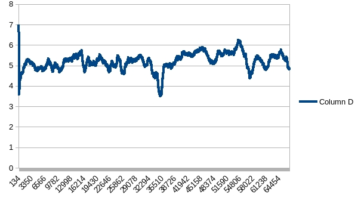

# A2C Experiments
## CartPole
Batch = 32

For MaxStep = 8 (TD(8)?), agent learned stable optimal policy after about 7,000 episodes. 
For MaxStep = 1, agent needs more steps.

For MaxStep = 8 case, the loss is huge and value loss dominated total loss:

Although value loss is large, action loss is relatively small.
This indicated that log_softmax(action) was small, and the agent is rather certain on action selection.

The entropy is stable and 1.3 > entropy > 0.3. 
* entropy coef is small (0.001)
* value + action loss is large
* number of actions = 2

Therefore, the entropy had been pushed into certainty to some degree, 
while not been pushed too much.

## Breakout
### Lesson learned
* Normalize input: observation from Gym is in range of [0, 255], to scale them in [0, 1].
Running mean had also been tried, leading worse performance. Maybe it should be tested by more steps as RSM is unstable at the beginning. Or there was something wrong in my implementation.
* Normalize reward: large reward gap may cause huge advantage and network exploitation
* To works with environment "BreakoutNoFrameskip-v4", other versions are harder to train. *???(link)*

### test4
|name|value|
|---|---|
|batchsize|32|
|episode|102400|
|entropy coef|0.001|
|max step|8|

The reward trapped around 4

### test5
|name|value|
|---|---|
|batchsize|32|
|entropy coef|0.001|
|max step|16|
Not completed

### test6
Network with normbatch.

Bad performance

### test7
Network with 4 Conv layers and RSM. Huge value loss at very beginning

|seq|loss|value loss|action loss|entropy|
|---|----|----------|-----------|-------|
|1|4.20273|3.13428|1.06973|1.28127|
|2|809071|809071|-0|-0|
|3|211.014|213.822|-2.80799|0.305423|
|4|13783.8|13783.8|-0|2.69e-07|
|5|1.05072|1.05072|8.69663e-07|1.61256e-05|

### test10
Reward clip [-10, 10] hurt performance, range [-1, 1] better

### test11
Continue training test10 model, nothing more learned:

### test12
Seemed entropy is too small to explore in test11. Reduce eocf into 0.01 and still continue training model trained by test10:

Continue training model generated by test12, it was trapped or exploring:

### test14
Try to reduce coef of value loss to push action distinguish, with model generated by test13 

The performance improved but still trapped:

### test15
Try to extend reward range to distinguish good action and better action, no better result:

Continue training model generated by test15 leads to some improvement, but still no better than [-1, 1] cases.

### test17
Try smaller steps to make keeping living as the ultimate target. 

Seemed that step = 8 is better:

### Conclusion:
Try more training on:

|name|value|
|----|-----|
|batch size|32|
|max step|8|
|entropy|0.01|
|value|0.25|
|reward|[-1, 1]|
|input|/255|
