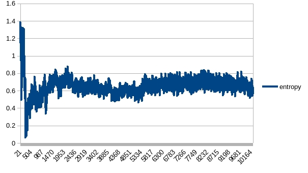

# A2C Breakout
## Tests
Reward: Natural reward per life. Not clipped reward. Not reward per episode (5 lives)

X axis: Number of update

### test2
|name|value|
|----|-----|
|entropyCoef|0.01|
|valueCoef|0.5|
|maxGradNormClip|0.1|
|reward|[-1000, 1000]|
|maxStep|16|
|envNum|50|
|model|AirACCnnNet|

The extended reward scope led to divergence. The value loss did not explore but entropy indicated that unexpected reward destroyed the model. The model recovered after about 2,000 episodes.

### test4
|name|value|
|----|-----|
|entropyCoef|0.01|
|valueCoef|0.5|
|maxGradNormClip|0.1|
|reward|[-1, 1]|
|normReward|false|
|maxStep|8|
|envNum|50|
|model|AirACCnnNet|

Similar to test3. *normReward* did not matter. *maxStep* did not help.

### test5
|name|value|
|----|-----|
|entropyCoef|0.01|
|valueCoef|0.5|
|maxGradNormClip|0.1|
|reward|[-1000, 1000]|
|normReward|true|
|maxStep|20|
|envNum|50|
|model|AirACCnnNet|

Worked, but not stable. Still rather unstable entropy in beginning.

### test8
|name|value|
|----|-----|
|entropyCoef|0.01|
|valueCoef|0.5|
|maxGradNormClip|0.1|
|reward|[-1, 1]|
|normReward|false|
|maxStep|40|
|envNum|50|
|model|AirACCnnNet|

Seemed variance introduced by *maxStep = 40* is hard to converge

### test9/test10/test11
|name|value|
|----|-----|
|entropyCoef|0.01|
|valueCoef|0.5|
|maxGradNormClip|0.5|
|reward|[-100, 100]|
|normReward|false|
|maxStep|10|
|envNum|50|
|model|AirACCnnNet|

Set reward scope as [-100, 100] hoping the agent learns most efficient actions.

After continuous training:

### test13/test14
Continue training model generated by test11. Each training got improvement, but slow and unstable.

### test15
Continue training model generated by test14. Still improved and unstable. 
Maybe the dominating value loss pushed the agent being hard to explore.

### test17
Continue training model generated by test15. Seemed no better than result of test15

### test16
|name|value|
|----|-----|
|entropyCoef|0.01|
|valueCoef|0.1|
|maxGradNormClip|0.5|
|reward|[-100, 100]|
|normReward|false|
|maxStep|20|
|envNum|50|
|model|AirACCnnNet|

To reduce the significance of value loss, decrease the *valueCoef*. Also try increasing *maxStep*.

The reward indicated that learning was slow and unstable. The value loss has been restrained, but the entropy indicated that the agent was not learning.

### test18
|name|value|
|----|-----|
|entropyCoef|0.01|
|valueCoef|0.5|
|maxGradNormClip|0.5|
|reward|[-100, 100]|
|normReward|false|
|maxStep|10|
|envNum|80|
|model|AirACCnnNet|

Increased batchSize(envNum) to increase stability based on model generated by test17. It was better than the result of case envNum = 50.

The test result is not bad:

Reward for each life:

Reward for each episode (5 lives):

### test0
Turn to [-1, 1] reward.

|name|value|
|----|-----|
|entropyCoef|0.01|
|valueCoef|0.5|
|maxGradNormClip|0.1|
|reward|[-1, 1]|
|maxStep|16|
|envNum|50|
|model|AirACCnnNet|

Reward is promising.

### test1
|name|value|
|----|-----|
|entropyCoef|0.01|
|valueCoef|0.25|
|maxGradNormClip|0.1|
|reward|[-1, 1]|
|maxStep|16|
|envNum|50|
|model|AirACCnnNet|

Reward trapped around 25. Entropy seemed reasonable.
Seemed (value = 0.25) made value estimation fails to catch up with change of input.
Or maybe it requires more training episodes.

### test3
|name|value|
|----|-----|
|entropyCoef|0.01|
|valueCoef|0.5|
|maxGradNormClip|0.1|
|reward|[-1, 1]|
|normReward|true|
|maxStep|16|
|envNum|50|
|model|AirACCnnNet|

Continue training on test0 model, no improvement. While there were about only 1,000 episodes, can not prove that it is a bad model.

### test201/test202
|name|value|
|----|-----|
|entropyCoef|0.01|
|valueCoef|0.5|
|maxGradNormClip|0.5|
|reward|[-1, 1]|
|normReward|false|
|maxStep|16|
|envNum|50|
|model|AirACCnnNet|

Continue training model generated by test3. Reward was measured by number of steps per life.

### test203
|name|value|
|----|-----|
|entropyCoef|0.01|
|valueCoef|0.5|
|maxGradNormClip|0.5|
|reward|[-1, 1]|
|normReward|false|
|maxStep|20|
|envNum|50|
|model|AirACHONet|

Increase *maxStep* and model capacity. 

The statistic file had been destroyed.

### test204
|name|value|
|----|-----|
|entropyCoef|0.01|
|valueCoef|0.5|
|maxGradNormClip|0.5|
|reward|[-1, 1]|
|normReward|false|
|maxStep|20|
|envNum|50|
|model|AirACHONet|

Continue training model generated by test203

While not stable, the reward the agent learned was good.
The value_loss was larger than expected, but entropy and action_loss matched the expectation.

And test result of reward per episode(5 lives)

### test205
Continue training model generated by test204. Seemed no obvious improvement.

Test result indicated that model of the best average reward per life is not same as that of the best average reward per episode(5 lives):

* The best average reward per life = 120
* The best average reward per episode = 420

Average reward per life of 120 case:

Average reward per episode of 120 case:

Average reward per life of 420 case:

Average reward per episode of 420 case:

## Conclusion
* For A2C, the actor and critical parts requires more capacity than only 1 output layer.
* Too many steps per update makes the model hard to converge. Maybe larger batch size could solve it.
* Seemed this game is to learn how to keep living instead of smart strategy (e.g. get more reward per step). Constraint reward in [-1, 1] makes the model easier to learn. 
* For reason mentioned above, the agent is easy to hang at the end of episode. That is, agent knows how to keep the ball in the air but does not know the target of hitting the brick.
* Larger batch size helps.

