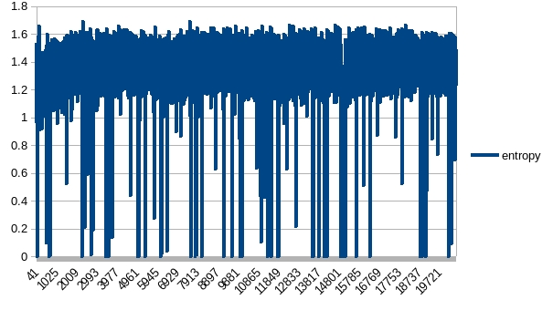
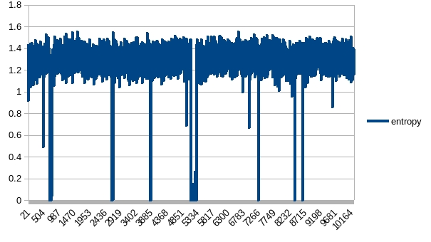
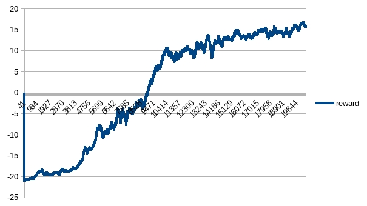
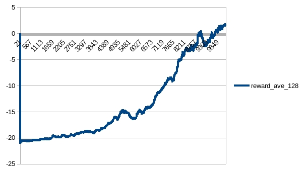

# A2C PongNoFrameskip-v4

__TODO__
* Network description
* X label is number of update

## AirACCnnNet
### test0
Parameters copied from StableBaselines3

|name|value|
|----|-----|
|env_num|16|
|#step|5|
|batchSize|16 * 5|
|entropyCoef|0.01|
|valueCoef|0.25|
|maxGradNormClip|0.5|
|optimizer|RMS|
|learningRate|7e-4|
|eps|1e-5|
|alpha|0.99|

It learned very slowly.

The entropy is rather unstable. It seemed that whenever agent thought it learned something,
it was over-confident. And the estimated optimal action was proved to be a very bad choice immediately.
Then agent returned to random guess. So the entropy increased and decreased dramatically. 
While overall, it intended to decrease. That is, the agent had learned something, but in a very hard way.

The action_loss/total_loss ratio seemed proved it. 
The first black arrow shows that there was almost no action_loss. 
The second black arrow shows that at that time, action_loss = 0 and total_loss = 0.

### test1
Continue to see if the unstable learning was just because of unlucky start.

|name|value|
|----|-----|
|env_num|16|
|#step|5|
|batchSize|16 * 5|
|entropyCoef|0.01|
|valueCoef|0.25|
|maxGradNormClip|0.5|
|optimizer|RMS|
|learningRate|7e-4|
|eps|1e-5|
|alpha|0.99|

While it just failed to learn.

### test2
Increase _valueCoef_ to push estimation of V(s), hope to help decrease variance (according to reward shaping)

|name|value|
|----|-----|
|env_num|16|
|#step|5|
|batchSize|16 * 5|
|entropyCoef|0.01|
|valueCoef|0.5|
|maxGradNormClip|0.5|
|optimizer|RMS|
|learningRate|7e-4|
|eps|1e-5|
|alpha|0.99|

Seemed improved, while still bad:

### test3/test4
Continue test2 parameters for more updates:

|name|value|
|----|-----|
|env_num|16|
|#step|5|
|batchSize|16 * 5|
|entropyCoef|0.01|
|valueCoef|0.5|
|maxGradNormClip|0.5|
|optimizer|RMS|
|learningRate|7e-4|
|eps|1e-5|
|alpha|0.99|

Still failed:

### test5
Decreased *entropyCoef* hope to reduce exploration and variance

|name|value|
|----|-----|
|env_num|16|
|#step|5|
|batchSize|16 * 5|
|entropyCoef|0.005|
|valueCoef|0.5|
|maxGradNormClip|0.5|
|optimizer|RMS|
|learningRate|7e-4|
|eps|1e-5|
|alpha|0.99|

Seemed a catastrophical forgetting:

### test7
Increase _entropyCoef_ 

|name|value|
|----|-----|
|env_num|16|
|#step|5|
|batchSize|16 * 5|
|entropyCoef|0.02|
|valueCoef|0.5|
|maxGradNormClip|0.5|
|optimizer|RMS|
|learningRate|7e-4|
|eps|1e-5|
|alpha|0.99|

Failed to learn:

### test6
Increased _env_num_ to reduce variance based on test3

|name|value|
|----|-----|
|env_num|32|
|#step|5|
|batchSize|32 * 5|
|entropyCoef|0.01|
|valueCoef|0.5|
|maxGradNormClip|0.5|
|optimizer|RMS|
|learningRate|7e-4|
|eps|1e-5|
|alpha|0.99|

Compared to 16 env_num case (test4), 32 instances has better reward, although with similar trend.

The entropy was still unstable, but there was no case that entropy remained 0 in a relatively long term (between 15,000 and 20,000 in blue in following figure). 

### test8
Continue more updates based on test6

|name|value|
|----|-----|
|env_num|32|
|#step|5|
|batchSize|32 * 5|
|entropyCoef|0.01|
|valueCoef|0.5|
|maxGradNormClip|0.5|
|optimizer|RMS|
|learningRate|7e-4|
|eps|1e-5|
|alpha|0.99|

Get positive average reward first time, but still dramatical decrease when the entropy diminished:

### test9
Continue more updates based on test8

|name|value|
|----|-----|
|env_num|32|
|#step|5|
|batchSize|32 * 5|
|entropyCoef|0.01|
|valueCoef|0.5|
|maxGradNormClip|0.5|
|optimizer|RMS|
|learningRate|7e-4|
|eps|1e-5|
|alpha|0.99|

Had less diminished entropy and bigger average reward. But there were still sudden catastrophe at the end of training. 

### testtest9
A validation on test9 model.

It shows that agent had learned the policy on how to win the game with max reward,
but maybe not good at dealing with certain competitors:

### test10
Reduced *entropyCoef* to check if negative reward cases in testtest9 was caused by too much exploration. 

|name|value|
|----|-----|
|env_num|32|
|#step|5|
|batchSize|32 * 5|
|entropyCoef|0.005|
|valueCoef|0.5|
|maxGradNormClip|0.5|
|optimizer|RMS|
|learningRate|7e-4|
|eps|1e-5|
|alpha|0.99|

The agent just did not converge:

### test11/test14
Try an entropy between 0.01 and 0.005

|name|value|
|----|-----|
|env_num|32|
|#step|5|
|batchSize|32 * 5|
|entropyCoef|0.008|
|valueCoef|0.5|
|maxGradNormClip|0.5|
|optimizer|RMS|
|learningRate|7e-4|
|eps|1e-5|
|alpha|0.99|

It was promising in short term:

But crashed after more updates:

### test12 
Recover entropy as 0.01 and try again:

|name|value|
|----|-----|
|env_num|32|
|#step|5|
|batchSize|32 * 5|
|entropyCoef|0.01|
|valueCoef|0.5|
|maxGradNormClip|0.5|
|optimizer|RMS|
|learningRate|7e-4|
|eps|1e-5|
|alpha|0.99|

Still similar to test9

### test13
Descreased maxGradNormClip to make the agent update more carefully

|name|value|
|----|-----|
|env_num|32|
|#step|5|
|batchSize|32 * 5|
|entropyCoef|0.01|
|valueCoef|0.5|
|maxGradNormClip|0.1|
|optimizer|RMS|
|learningRate|7e-4|
|eps|1e-5|
|alpha|0.99|

It did not help:

### test15
Extended maxstep before update

|name|value|
|----|-----|
|env_num|32|
|#step|8|
|batchSize|32 * 8|
|entropyCoef|0.01|
|valueCoef|0.5|
|maxGradNormClip|0.5|
|optimizer|RMS|
|learningRate|7e-4|
|eps|1e-5|
|alpha|0.99|

It was worse:

## AirACHONet
Guessed that Stablebaselines3 has fine-tuned their codes 
so that the simple _AirACCnnNet_ could reach the optimal policy. 

Turned to _Deep Reinforcement Learning Hands-On_ to repeat its A2C case 
and hoped that the network with more cells could solve the problem.

### test17

|name|value|
|----|-----|
|env_num|32|
|#step|5|
|batchSize|32 * 5|
|entropyCoef|0.01|
|valueCoef|0.5|
|maxGradNormClip|0.1|
|optimizer|Adam|
|learningRate|0.001|
|eps|1e-3|

It worked:

### test18
Try Stablebaselines3 parameters:

|name|value|
|----|-----|
|env_num|32|
|#step|5|
|batchSize|32 * 5|
|entropyCoef|0.01|
|valueCoef|0.5|
|maxGradNormClip|0.1|
|optimizer|RMS|
|learningRate|7e-4|
|eps|1e-5|
|alpha|0.99|

It indicated that the problem did not lay in network structure:

### test19
Extended maxStep:

|name|value|
|----|-----|
|env_num|32|
|#step|8|
|batchSize|32 * 8|
|entropyCoef|0.01|
|valueCoef|0.5|
|maxGradNormClip|0.1|
|optimizer|RMS|
|learningRate|7e-4|
|eps|1e-5|
|alpha|0.99|

It was unstable, but learned:

### test20
Tried to increase maxStep and env_num to increase batchSize to improve stability. 
And to reduce valueCoef to push significance of action_loss

|name|value|
|----|-----|
|env_num|50|
|#step|10|
|batchSize|50 * 10|
|entropyCoef|0.01|
|valueCoef|0.25|
|maxGradNormClip|0.1|
|optimizer|RMS|
|learningRate|7e-4|
|eps|1e-5|
|alpha|0.99|

It worked:

And actionLoss dominated overall loss:

### testtest20
Test model generated by test20. The agent had learned how to win.
In some games it won by max reward, some games it won by slim edge.

### test21
Increase valueCoef:

|name|value|
|----|-----|
|env_num|50|
|#step|10|
|batchSize|50 * 10|
|entropyCoef|0.01|
|valueCoef|0.5|
|maxGradNormClip|0.1|
|optimizer|RMS|
|learningRate|7e-4|
|eps|1e-5|
|alpha|0.99|

valueCoef is not a very critical factor. test21 still worked. But at update#10240, it was a bit slower than test20

### test22
The slope of reward increasing is gentle after ave_reward = 10 reached.
Reduced entropyCoef to reduce exploration. Reduce valueCoef to push action_loss optimization.
Based on model generated by test20.

|name|value|
|----|-----|
|env_num|50|
|#step|10|
|batchSize|50 * 10|
|entropyCoef|0.005|
|valueCoef|0.5|
|maxGradNormClip|0.1|
|optimizer|RMS|
|learningRate|7e-4|
|eps|1e-5|
|alpha|0.99|

Seemed that the agent trapped in sub-optimal policy:

### test23
Recover parameters of test21 and continue with more updates:

|name|value|
|----|-----|
|env_num|50|
|#step|10|
|batchSize|50 * 10|
|entropyCoef|0.01|
|valueCoef|0.25|
|maxGradNormClip|0.1|
|optimizer|RMS|
|learningRate|7e-4|
|eps|1e-5|
|alpha|0.99|

Although entropy decreased, reward performance did not improve:

### test24
Try smaller entropyCoef as model generated by test22 was supposed to be relatively confident.

|name|value|
|----|-----|
|env_num|50|
|#step|10|
|batchSize|50 * 10|
|entropyCoef|0.01|
|valueCoef|0.25|
|maxGradNormClip|0.1|
|optimizer|RMS|
|learningRate|7e-4|
|eps|1e-5|
|alpha|0.99|

Entropy indicated that the model did exploared and adjusted

But no improvement on reward:

Seemed the model had reached its best.

### testtest24
And test result was not bad:

### test25
Try bigger valueCoef as accurate value estimation helps reducing bias (by reward shaping).
The model is based on model generated by test24

|name|value|
|----|-----|
|env_num|50|
|#step|10|
|batchSize|50 * 10|
|entropyCoef|0.001|
|valueCoef|0.5|
|maxGradNormClip|0.1|
|optimizer|RMS|
|learningRate|7e-4|
|eps|1e-5|
|alpha|0.99|

But rewward result was no better or worse than test24:

### test26
Try even smaller entropyCoef:
The model is based on model generated by test24

|name|value|
|----|-----|
|env_num|50|
|#step|10|
|batchSize|50 * 10|
|entropyCoef|0.0005|
|valueCoef|0.25|
|maxGradNormClip|0.1|
|optimizer|RMS|
|learningRate|7e-4|
|eps|1e-5|
|alpha|0.99|

It did not work:

### test27
Decrease maxStep and entropyCoef.

|name|value|
|----|-----|
|env_num|50|
|#step|5|
|batchSize|50 * 5|
|entropyCoef|0.001|
|valueCoef|0.25|
|maxGradNormClip|0.1|
|optimizer|RMS|
|learningRate|7e-4|
|eps|1e-5|
|alpha|0.99|

The reward was decreasing. Don't know which factor weighted. Or maybe it was adjusting to new parameters, it might be able to improve with more updates.

### test28
Continue test24 with smaller entropyCoef and larger batchSize and maxStep

|name|value|
|----|-----|
|env_num|80|
|#step|10|
|batchSize|80 * 10|
|entropyCoef|0.001|
|valueCoef|0.25|
|maxGradNormClip|0.1|
|optimizer|RMS|
|learningRate|7e-4|
|eps|1e-5|
|alpha|0.99|

No improvement compared to test24:

And entropy of test24 seemed more healthy:

Entropy in above figure has had tail cut. The figure for all updates showed it is decreasi with mild rise and fall:

### test29
Increase maxStep to check if the agent was short-sighted based on test28

|name|value|
|----|-----|
|env_num|50|
|#step|16|
|batchSize|50 * 16|
|entropyCoef|0.001|
|valueCoef|0.25|
|maxGradNormClip|0.1|
|optimizer|RMS|
|learningRate|7e-4|
|eps|1e-5|
|alpha|0.99|

The training result had been covered by test32

### testtest29
Model of test24 is better, increasing maxStep did not help:

###  test30
Increase maxGradNormClip to allow more exceptional samples based on test28

|name|value|
|----|-----|
|env_num|50|
|#step|10|
|batchSize|50 * 10|
|entropyCoef|0.001|
|valueCoef|0.25|
|maxGradNormClip|0.5|
|optimizer|RMS|
|learningRate|7e-4|
|eps|1e-5|
|alpha|0.99|

Worse than test24

### test31
Increase entropy and maxStep based on test29

|name|value|
|----|-----|
|env_num|50|
|#step|16|
|batchSize|50 * 16|
|entropyCoef|0.002|
|valueCoef|0.25|
|maxGradNormClip|0.1|
|optimizer|RMS|
|learningRate|7e-4|
|eps|1e-5|
|alpha|0.99|

Reward was better than that of test24:

While entropy of test24 seemed better:

### test32
Brute force:

|name|value|
|----|-----|
|env_num|80|
|#step|16|
|batchSize|80 * 16|
|entropyCoef|0.001|
|valueCoef|0.25|
|maxGradNormClip|0.1|
|optimizer|RMS|
|learningRate|7e-4|
|eps|1e-5|
|alpha|0.99|

Seemed better than test31 while still failed to get the optimal policy that average-reward = 21.

## Conclusion
### Optimizer
Adam seemed more stable [test17](###test17) vs [test18](###test18).

__TODO__: stable baelines mentioned minor problem in pytorch RMS implementation. 

### env_num
|env_num|case|
|-------|----|
|16|[test0](###test0), [test1](###test1), [test2](###test2), [test3](###test3/test4), [test5](###test5), [test7](###test7)|
|32|[test6](###test6), [test8](###test8), [test9](###test9), [test10](###test10), [test14](###test11/test14), [test12](###test12), [test13](###test13), [test15](###test15), [test17](###test17), [test18](###test18), [test19](###test19)|
|50|[test20](###test20), [test21](###test21), [test22](###test22), [test23](###test23), [test24](###test24), [test25](###test25), [test26](###test26), [test27](###test27), [test29](###test29), [test30](###test30), [test31](###test31)|
|80|[test28](###test28), [test32](###test32)|

* 16 instances: according to entropy figures, sudden diminish is no uncommon
* 32 instances: performance is better than that of 16_instance cases ([test8](###test8)),
but seldom diminish still prevented the agent to learn more reward; with [test17](###test17) as exceptional for Adam optimizer.
* 50 instances: all cases worked. [test27](###test27) is the exception, but don't know the cause.
* 80 instances: maybe a slim improvement over 50_instance cases. Anyway, it did no harm except computing resrouces.

### #step
|step|case|
|----|----|
|5|[test0](###test0), [test1](###test1), [test2](###test2), [test3,test4](###test3/test4), [test5](###test5), [test7](###test7), [test6](###test6), [test8](###test8), [test9](###test9), [test10](###test10), [test11/test14](###test11/test14), [test12](###test12), [test13](###test13), [test17](###test17), [test18](###test18), [test27](###test27)|
|8|[test15](###test15), [test19](###test19)|
|10|[test20](###test20), [test21](###test21), [test22](###test22), [test23](###test23), [test24](###test24), [test25](###test25), [test26](###test26), [test28](###test28), [test30](###test30)|
|16|[test29](###test29), [test31](###test31), [test32](###test32)|

* 5: Although only [test17](###test17) worked, it proved that 5 is a possible candidate.
* 8: No good cases. Maybe there was not enough case to prove its feasibility.
* 10: All cases generated not bad performance. While _env_num_ >= 50 in all these cases. Don't know which factor contributed more.
* 16: Compared to [test24](###test24), it is hard to decide if 16-step is better than 10-step as the improvement is hard to detect and _entropyCoef_ changed.

### entropyCoef
|value|case|
|-----|----|
|0.0005|26|
|0.001|25, 27, 28, 29, 30, 32|
|0.002|31|
|0.005|5, 10, 22|
|0.008|11, 14|
|0.01|0, 1, 2, 3, 4, 6, 8, 9, 12, 13, 15, 17, 18, 19, 20, 21, 23, 24|
|0.02|7|

* 0.0005: When the agent reached sub-optimal (average_reward > 18), _entropyCoef_ = 0.0005 lead to performance decline [test26](###test26).
* 0.001: When the agent reached sub-optimal (average_reward > 18), _entropyCoef = 0.001 lead to performance decline ([test24](###test24) vs. [test27](###test27))
* 0.002: [test31](###test31) vs. [test24](###test24) showed a better result, but not sure if the entropy or maxStep helped. Guess it was _maxStep_ that weighted.
* 0.005: [test20](###test20) vs. [test22](###test22) indicated that performance of 0.005 was equivalent or worse than that of 0.01
* 0.008: Both cases failed for other parameters
* 0.01: Seemed a good choice. And it is the recommendation of both [baseline3](https://github.com/DLR-RM/rl-baselines3-zoo/blob/master/hyperparams/a2c.yml) and [_Hands-On_](https://github.com/PacktPublishing/Deep-Reinforcement-Learning-Hands-On/blob/master/Chapter10/04_pong_r2.py)
* 0.02: Only case is a failed case caused by other parameters

### valueCoef
|value|case|
|-----|----|
|0.25|0, 1, 20, 22, 23, 24, 26, 27, 28, 29, 30, 31, 32|
|0.5| 2, 3, 4, 5, 7, 6, 8, 9, 10, 11, 14, 12, 13, 15, 17, 18, 19, 21, 25, |

Seemed that 0.25 is a better choice as 
* Refer to [test25](###test25) vs. [test24](###test24)
* All best result (case 24, 31, 32) were all in category of 0.25

Maybe it is not a parameter to tuned the very first