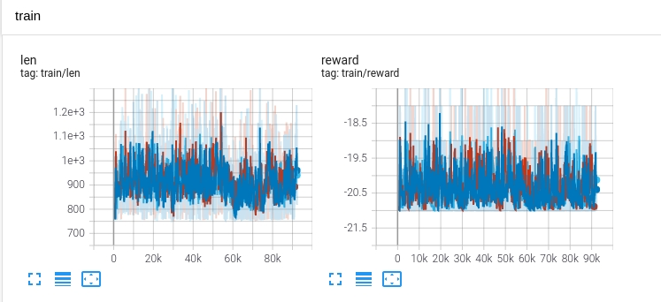

# Asynchronized Actor-Critic

## Ref
* [an A3C demo](https://github.com/ikostrikov/pytorch-a3c)
* [an A3C demo](https://github.com/wisnunugroho21/asynchronous_impala_PPO)
* [an APPO demo](https://github.com/ray-project/ray/blob/master/rllib/agents/ppo/appo.py)
* [an APPO demo](https://github.com/ikostrikov/pytorch-a2c-ppo-acktr-gail)
* Original paper

## Test Cases
### Asynchronized by grad parameters
It applied original A3C algorithm.
* Multiple workers and one updater. Each worker or updater is executed in different process/ 
* Each worker and updater holds a network instance
* Workers send grad parameters to updater, updater sends network parameters to worker.
* Workers and updater communicate by network(TCP)

#### testcart0
|name|value|
|----|-----|
|Optimizer|Adam|
|lr|0.001|
|valueCoef|0.5|
|entropyCoef|0.01|
|maxGradNormClip|0.1|
|gamma|0.99|
|reward|[-1, 1]|
|batchSize|32|
|maxStep|8|
|gradSyncStep|32|
|targetUpdateStep|32|

TODO: To test again

#### testpong1
|name|value|
|----|-----|
|Optimizer|Adam|
|lr|0.001|
|valueCoef|0.5|
|entropyCoef|0.01|
|maxGradNormClip|0.1|
|gamma|0.99|
|reward|[-1, 1]|
|batchSize|32|
|maxStep|8|
|gradSyncStep|16|
|targetUpdateStep|16|
|updateThread|2|

The worker calculates the grad parameters and accumulates (sum up) these grad parameters 
produced in *gradSyncStep*.
The server(updater) receives all grad parameters from all the workers and simply update the network by *optimizer.step()*.
The server is serviced by 2 threads without synchronization. 

This test failed:

#### testpong2
|name|value|
|----|-----|
|Optimizer|Adam|
|lr|1e-4|
|valueCoef|0.5|
|entropyCoef|0.01|
|maxGradNormClip|0.1|
|gamma|0.99|
|reward|[-1, 1]|
|batchSize|50|
|maxStep|5|
|gradSyncStep|10|
|targetUpdateStep|10|
|updateThread|2|

It worked.

#### testpong3
|name|value|
|----|-----|
|Optimizer|Adam|
|lr|1e-4|
|valueCoef|0.5|
|entropyCoef|0.01, 0.01, 0.01, 0.005|
|maxGradNormClip|0.1|
|gamma|0.99|
|reward|[-1, 1]|
|batchSize|50|
|maxStep|5|
|gradSyncStep|20|
|targetUpdateStep|40|
|updateThread|1|

With more workers, variable *entropyCoef*, only one server thread, synchronization interval increased.

This case is better than __testpong2__: the training reward reached maximum after about 300k steps,
while in this case  the training reward got 21 after about 150k steps. Don't know which factor weighted.

#### testpong4
|name|value|
|----|-----|
|Optimizer|Adam|
|lr|1e-4|
|valueCoef|0.5|
|entropyCoef|0.01, 0.02, 0.005|
|maxGradNormClip|0.1|
|gamma|0.99|
|reward|[-1, 1]|
|batchSize|50|
|maxStep|5|
|gradSyncStep|10|
|targetUpdateStep|20|
|updateThread|1|

The different from testpong3:
* 3 workers
* different *entropyCoef*
* shorter synchronization span  
* Updater received and update each grad parameter package and update all the received grads sequentially.

With less worker than __testpong3__, this case reached 21 by about 100k steps. It might be caused by:
1. shorter synchronization span
2. synchronization of update to avoid cancel

#### testpong5
|name|value|
|----|-----|
|Optimizer|Adam|
|lr|1e-4|
|valueCoef|0.5|
|entropyCoef|0.05, 0.01, 0.02, 0.005|
|maxGradNormClip|0.1|
|gamma|0.99|
|reward|[-1, 1]|
|batchSize|50|
|maxStep|5|
|gradSyncStep|10|
|targetUpdateStep|20|
|updateThread|2|

Core dump. Maybe caused by concurrent update.

So the potential cause #2 in previous case is less possible

#### testpong6
|name|value|
|----|-----|
|Optimizer|Adam|
|lr|5e-4|
|valueCoef|0.5|
|entropyCoef|0.05, 0.01, 0.02, 0.005|
|maxGradNormClip|0.1|
|gamma|0.99|
|reward|[-1, 1]|
|batchSize|50|
|maxStep|5|
|gradSyncStep|5|
|targetUpdateStep|20|
|updateThread|1|
|#worker|3|

It failed.

#### testpong7
|name|value|
|----|-----|
|Optimizer|Adam|
|lr|1e-3|
|valueCoef|0.5|
|entropyCoef|0.05, 0.01, 0.02, 0.005|
|maxGradNormClip|0.1|
|gamma|0.99|
|reward|[-1, 1]|
|batchSize|50|
|maxStep|5|
|gradSyncStep|20|
|targetUpdateStep|40|
|updateThread|1|
|#worker|4|

It failed.

### Asynchronized by network(model)
It applied original A3C algorithm.
* Multiple workers and no updater
* All workers share a same network
* Each worker runs forward phrase independently
* Each worker runs backward phrase by its own, but the (backward + update) were executed sequentially    
#### testpong9
|name|value|
|----|-----|
|Optimizer|Adam|
|lr|1e-3|
|valueCoef|0.5|
|entropyCoef|0.01, 0.01, 0.02, 0.005|
|maxGradNormClip|0.1|
|gamma|0.99|
|reward|[-1, 1]|
|batchSize|50|
|maxStep|5|
|updateThread|4|
|#worker|4|

Difference from previous cases:
* Network shared in the same process, no networking, no replica, no extra synchronization required
* Each worker executes backward and update by itself, but the updates were synchronized in sequential way. 

Compared to that of __testpong3__, performance of this case is much better. 
The number of steps taken to reach maximum is about half.
Compared to that of __testpong4__, the number of steps to reach maximum is about 3/4.

It might be because that the immediate update reduce the impact of off-policy trace to minimum.

#### testbr10
|name|value|
|----|-----|
|Optimizer|Adam|
|lr|1e-3|
|valueCoef|0.5|
|entropyCoef|0.01, 0.01, 0.02, 0.02, 0.005|
|maxGradNormClip|0.1|
|gamma|0.99|
|reward|[-1, 1]|
|batchSize|50|
|maxStep|5|
|updateThread|5|
|#worker|5|

It was a breakout test case.

The case followed the same architecture of __testpong9__. 

* The training encountered something like catastrophic forgetting, but it recovered
* The *test/len* is in a shape of dramatic increase. It is because that the agent hang around last few bricks in each episode.
* The *train/epReward* reached 400 at about 6k episodes. After that, the test case run for another 10k extra episode, but it still failed to overcome the hang.
* The *epReward* was the summary of rewards of 5 lives. When the agent hung, an episode may end in less than 5 lives.
* Anyway, the test case got reward of 400 in about 120k training steps. Not bad performance.

### Asynchronized by trajectories
Multiple workers, one updater. Worker interacts with Gym and sends trajectories to updater.
Network is shared between workers and updater. PPO algorithm adopted.
#### testpong2
Worker

|name|value|
|----|-----|
|gamma|0.99|
|lambda|0.95|
|inputScale|255|
|reward|[-1, 1]|
|batchSize|50|
|maxStep|32|
|#worker|4|

Updater

|name|value|
|----|-----|
|Optimizer|Adam|
|lr|3e-4|
|valueCoef|0.25|
|entropyCoef|0.01|
|epsilon|0.1|
|maxGradNormClip|0.1|
|batchSize|32 * 4|
|updateThread|1|

It was taken about 5k steps to get the maximum reward. It is very fast.
It is much faster than __testpong9__

#### testbr3
Worker

|name|value|
|----|-----|
|gamma|0.99|
|lambda|0.95|
|inputScale|255|
|reward|[-1, 1]|
|batchSize|50|
|maxStep|32|
|#worker|4|

Updater

|name|value|
|----|-----|
|Optimizer|Adam|
|lr|3e-4|
|valueCoef|0.25|
|entropyCoef|0.01|
|epsilon|0.1|
|maxGradNormClip|0.1|
|batchSize|32 * 4|
|updateThread|1|

It failed to learn. Another case with *worker.maxStep* = 16 also failed. To try smaller learning rate. 

#### testqb4
Test APPO on Qbert

Worker

|name|value|
|----|-----|
|gamma|0.99|
|lambda|0.95|
|inputScale|255|
|reward|[-1, 1]|
|batchSize|50|
|maxStep|16|
|#worker|5|

Updater

|name|value|
|----|-----|
|Optimizer|Adam|
|lr|3e-4|
|valueCoef|0.25|
|entropyCoef|0.01|
|epsilon|0.1|
|maxGradNormClip|0.1|
|batchSize|32 * 5|
|updateThread|1|

The system took less than 30k steps to get reward above 15,000, but failed to push forward.

## Conclusion
* Learning rate: 0.001 is too large to all above a3c cases. As [this paper](https://openreview.net/pdf?id=nIAxjsniDzg) recommended, 3e-4 is a good choice in most cases. To try less learning rate for APPO Breakout case.  
* TODO: shared network. The python version of A3C implementation always has network/model shared. Seemed there is such operation provided in pytorch-cpp. So, is that possible for network/model of pytorch-cpp being updated concurrently?