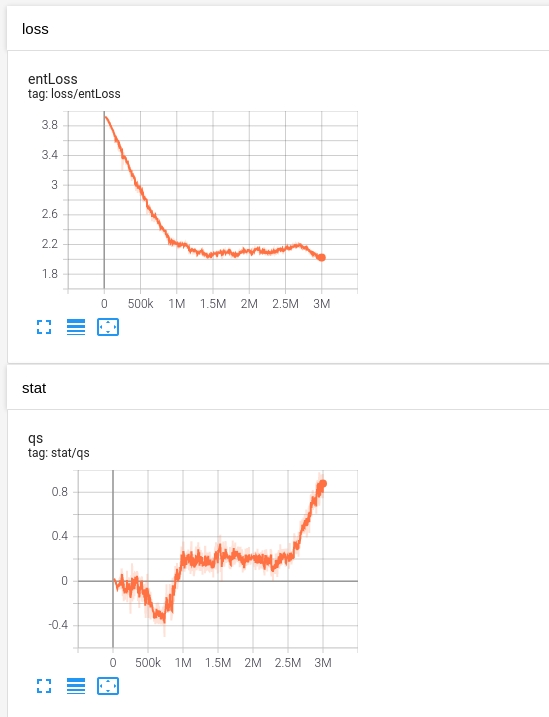
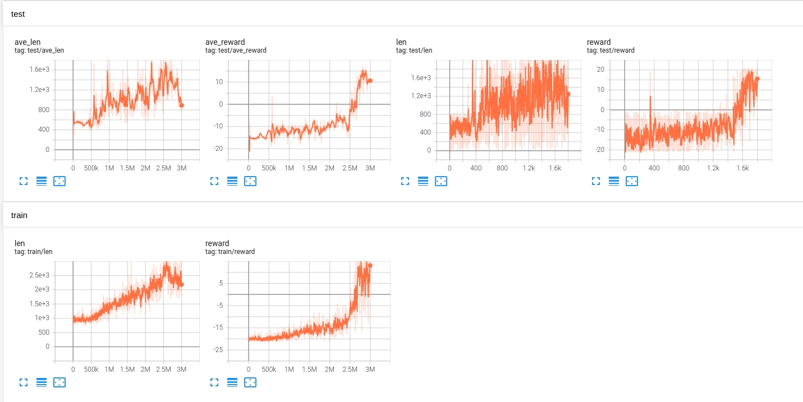
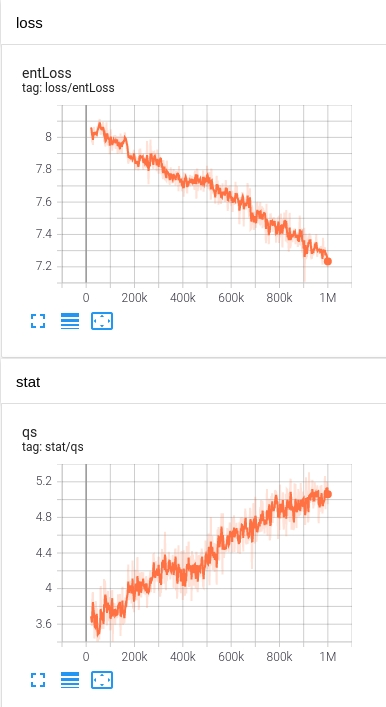
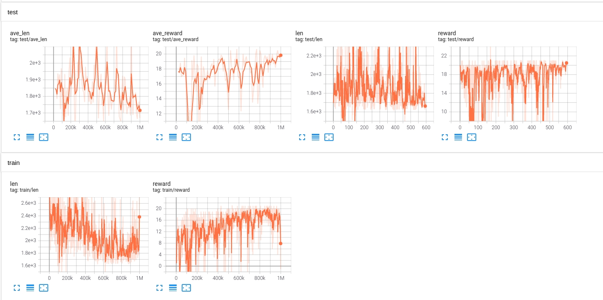

# Categorical DQN
## Reference
* [A demo](https://github.com/Hauf3n/Categorical-DQN-Atari-PyTorch)
* [table view](https://www.jianshu.com/p/20b587c95681)
* [ideas](https://zhuanlan.zhihu.com/p/44219477)
* [A demo](https://github.com/fedetask/categorical-dqn)

## Pong
### test0
|name|value|
|----|-----|
|clientNum|1|
|rbCap|300,000|
|targetUpdateStep|4,000|
|exploreBegin|1|
|exploreEnd|0.05|
|explorePart|0.6|
|inputScale|255|
|rewardScale|1|
|rewardMin|-1|
|rewardMax|1|
|gamma|0.99|
|envStep|8|
|epochPerUpdate|1|
|batchSize|32|
|startStep|10,000|
|maxGradNormClip|1|
|testEp|6|
|testGapEp|10,000|
|testBatch|6|
|livePerEpisode|1|
|vMin|-10|
|vMax|10|
|outputNum|6|
|atomNum|51|
|Policy|RawPolicy|
|optimizer|Adam|
|lr|1e-4|

### test1
Continue training model generated by test0 very much less exploration.

|name|value|
|----|-----|
|clientNum|1|
|rbCap|300,000|
|targetUpdateStep|4,000|
|exploreBegin|0.05|
|exploreEnd|0.01|
|explorePart|0.6|
|inputScale|255|
|rewardScale|1|
|rewardMin|-1|
|rewardMax|1|
|gamma|0.99|
|envStep|8|
|epochPerUpdate|1|
|batchSize|32|
|startStep|10,000|
|maxGradNormClip|1|
|testEp|6|
|testGapEp|10,000|
|testBatch|6|
|livePerEpisode|1|
|vMin|-10|
|vMax|10|
|outputNum|6|
|atomNum|51|
|Policy|RawPolicy|
|optimizer|Adam|
|lr|1e-4|

* It is not a stable result
* The q kept increasing, may more training steps lead to better performance
* Seemed no better than other DQN algorithm in Pong case
