# Double Dqn
All test cases are on Pong

## Test Cases
### testPong0
|name|value|
|----|-----|
|lr|0.001|
|rbCap|10240|
|startStep|1000|
|targetSyncStep|1000|
|exploreBegin|1|
|exploreEnd|0.01|
|explorePart|0.8|
|gamma|0.99|
|batchSize|32|
|inputScale|256|
|rewardScale|1|
|rewardMin|-1|
|rewardMax|1|
|updateStep|1e+6|

Something wrong in this case:

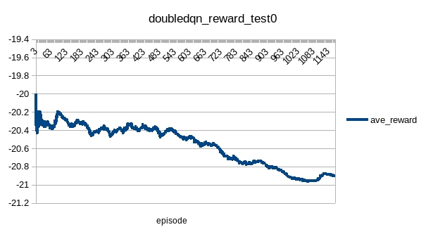

### testPong1
|name|value|
|----|-----|
|lr|0.001|
|rbCap|10240|
|startStep|1000|
|targetSyncStep|1000|
|exploreBegin|1|
|exploreEnd|0.01|
|explorePart|0.8|
|gamma|0.99|
|batchSize|128|
|inputScale|1|
|rewardScale|1|
|rewardMin|-1|
|rewardMax|1|
|updateStep|100,000|

The vanilla dqn learned even without input normalization. Try it on double dqn but failed:

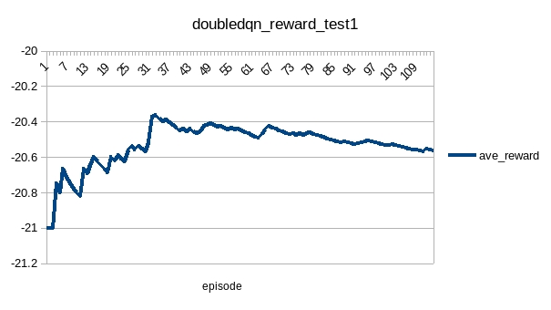

### testPong2
|name|value|
|----|-----|
|lr|0.001|
|rbCap|10240|
|startStep|1000|
|targetSyncStep|1000|
|exploreBegin|1|
|exploreEnd|0.1|
|explorePart|0.4|
|gamma|0.99|
|batchSize|32|
|inputScale|256|
|rewardScale|1|
|rewardMin|-1|
|rewardMax|1|
|updateStep|500,000|

As pong is a simple game, try more exploitation but failed:

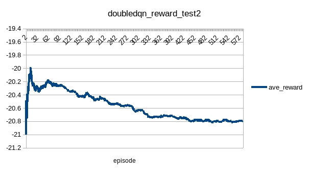

### testPong3
|name|value|
|----|-----|
|lr|0.0001|
|rbCap|10240|
|startStep|1000|
|targetSyncStep|1000|
|exploreBegin|1|
|exploreEnd|0.01|
|explorePart|0.8|
|gamma|0.99|
|batchSize|32|
|inputScale|256|
|rewardScale|1|
|rewardMin|-1|
|rewardMax|1|
|updateStep|500,000|

Try small learning rate. Better than previous cases:

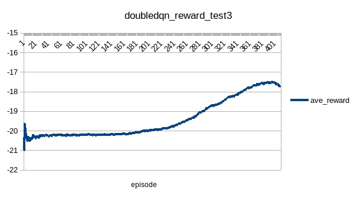

###  testPong4
|name|value|
|----|-----|
|lr|0.0001|
|rbCap|10240|
|startStep|1000|
|targetSyncStep|1000|
|exploreBegin|0.5|
|exploreEnd|0.01|
|explorePart|0.8|
|gamma|0.99|
|batchSize|32|
|inputScale|256|
|rewardScale|1|
|rewardMin|-1|
|rewardMax|1|
|updateStep|500,000|

Continue training model generated by test3 with less exploration but failed:

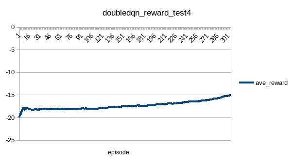

### testPong5
|name|value|
|----|-----|
|lr|0.0001|
|rbCap|10240|
|startStep|1000|
|targetSyncStep|1000|
|exploreBegin|0.2|
|exploreEnd|0.01|
|explorePart|0.8|
|gamma|0.99|
|batchSize|32|
|inputScale|256|
|rewardScale|1|
|rewardMin|-1|
|rewardMax|1|
|updateStep|500,000|

Continue training model generated by test4 with less exploration:

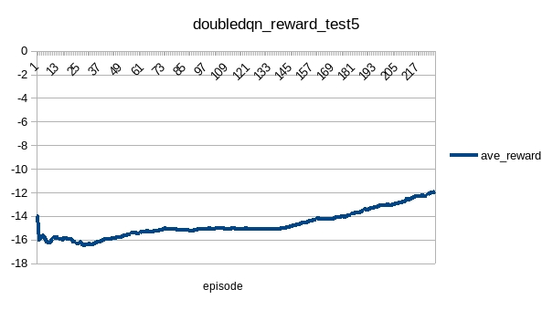

### testPong6
|name|value|
|----|-----|
|lr|0.0001|
|rbCap|10240|
|startStep|1000|
|targetSyncStep|1000|
|exploreBegin|0.2|
|exploreEnd|0.01|
|explorePart|0.8|
|gamma|0.99|
|batchSize|32|
|inputScale|256|
|rewardScale|1|
|rewardMin|-1|
|rewardMax|1|
|updateStep|500,000|

Continue training model generated by test5:

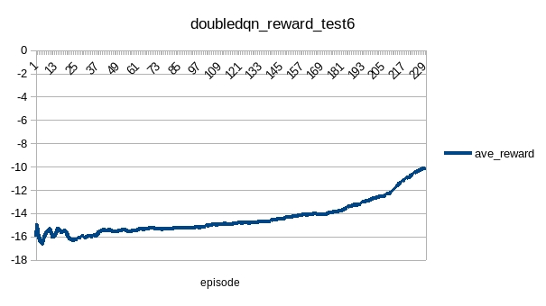

### testPong7
|name|value|
|----|-----|
|lr|0.0001|
|rbCap|10240|
|startStep|1000|
|targetSyncStep|1000|
|exploreBegin|0.1|
|exploreEnd|0.01|
|explorePart|0.8|
|gamma|0.99|
|batchSize|32|
|inputScale|256|
|rewardScale|1|
|rewardMin|-1|
|rewardMax|1|
|updateStep|?|

Continue training model generated by test6 with less exploration. The training data lost. The test result:

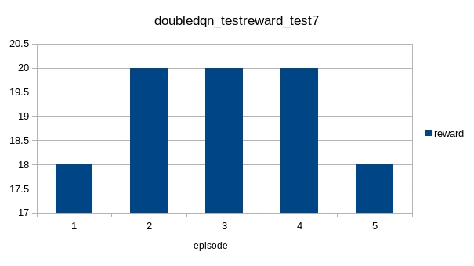

Although training data got max average reward as about 7, the test result is above 18. Pong is game with small space of randomness in action space.

### testPong8
|name|value|
|----|-----|
|lr|0.0001|
|rbCap|10240|
|startStep|1000|
|targetSyncStep|1000|
|exploreBegin|0.1|
|exploreEnd|0.01|
|explorePart|0.8|
|gamma|0.99|
|batchSize|32|
|inputScale|256|
|rewardScale|1|
|rewardMin|-1|
|rewardMax|1|
|updateStep|500,000|

Continue training model generated by test7 with less exploration.

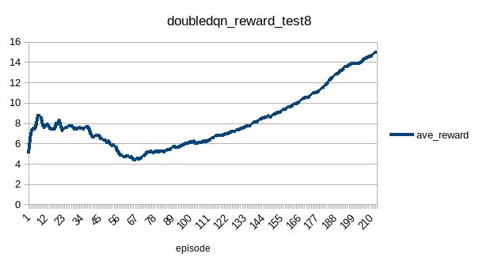

### testPong9
|name|value|
|----|-----|
|lr|0.0001|
|rbCap|10240|
|startStep|1000|
|targetSyncStep|1000|
|exploreBegin|0.02|
|exploreEnd|0.01|
|explorePart|0.8|
|gamma|0.99|
|batchSize|32|
|inputScale|256|
|rewardScale|1|
|rewardMin|-1|
|rewardMax|1|
|updateStep|500,000|

Continue training model generated by test8 with less exploration. The training reward was increasing while the test result was not better than that of test7.

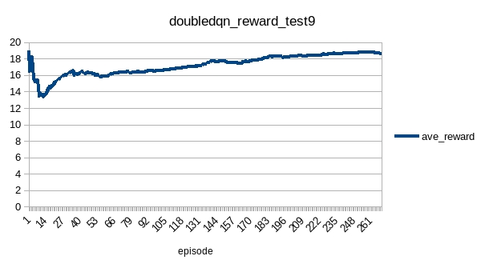

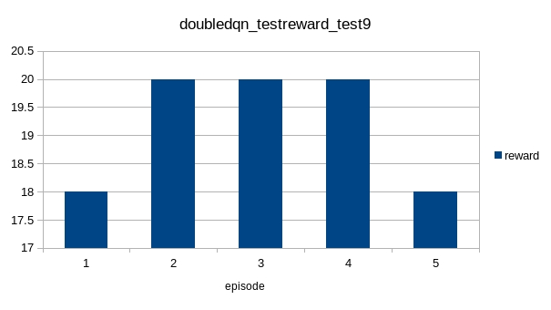

## Conclusion
* Dqn or Double Dqn is something like brute force algorithm to certain degree. With small learning rate, the simple game could be solved with large possibility.
* It'll be better to train a model with big enough steps than to train the same model in several phases.
* It'll be better to store checkpoint with timely evaluation as the epsilon affects training reward that it is hard to decide if the model is good enough with training statistics.