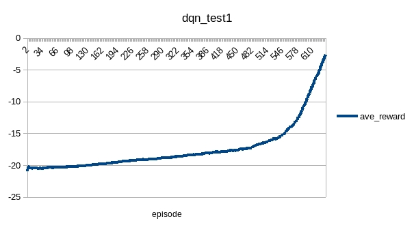
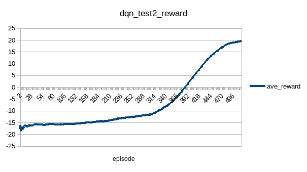
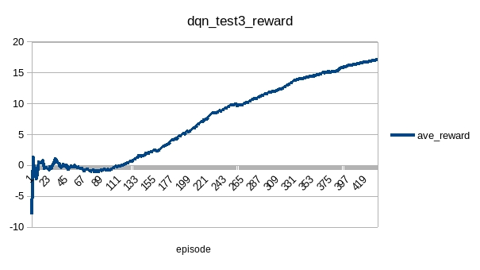
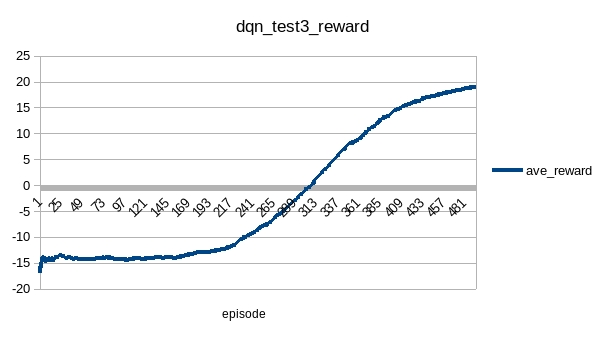
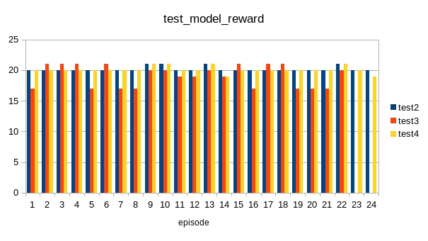

# DQN
## Pong
### test1
|name|value|
|----|-----|
|lr|0.0001|
|rbCap|10240|
|startStep|100|
|exploreBegin|1|
|exploreEnd|0.01|
|explorePart|0.8|
|gamma|0.99|
|batchSize|32|
|inputScale|1|
|rewardScale|1|
|rewardMin|-1|
|rewardMax|1|

The result is promising:

### test2
|name|value|
|----|-----|
|lr|0.0001|
|rbCap|10240|
|startStep|100|
|exploreBegin|0.5|
|exploreEnd|0.01|
|explorePart|0.8|
|gamma|0.99|
|batchSize|32|
|inputScale|1|
|rewardScale|1|
|rewardMin|-1|
|rewardMax|1|

Continue to train model generated by test1:

The agent has learned how to win.

### test3
|name|value|
|----|-----|
|lr|0.0001|
|rbCap|10240|
|startStep|100|
|exploreBegin|0.2|
|exploreEnd|0.01|
|explorePart|1|
|gamma|0.99|
|batchSize|32|
|inputScale|1|
|rewardScale|1|
|rewardMin|-1|
|rewardMax|1|

Continue training model generated by test2:

With greedyEpsilon > 0.8, the agent can never lose. But the max reward is less than that of test2.
It may be because of lack of exploration at the beginning, or randomness at the end of the training.

### test4
|name|value|
|----|-----|
|lr|0.0001|
|rbCap|10240|
|startStep|100|
|exploreBegin|0.5|
|exploreEnd|0.01|
|explorePart|0.8|
|gamma|0.99|
|batchSize|32|
|inputScale|1|
|rewardScale|1|
|rewardMin|-1|
|rewardMax|1|

Continue training model generated by test2:

Compared to test3, with same update step (1e6), test4 got better performance with more exploration at beginning and more exploitation at end of training.
The curves shown in both cases kept increasing even at the last episode. It may reach max reward (21) with more update steps as theory suggested.

### test result

The test result shows that test2 model is good enough, more episode training (test4) does not help;
exploitation on a good enough model (test2) does not help (test3)

## Breakout
Not worked out yet.