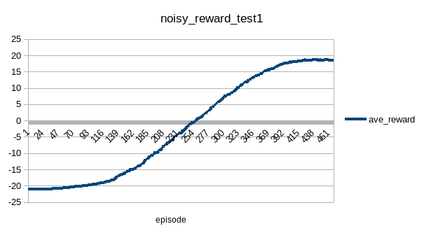
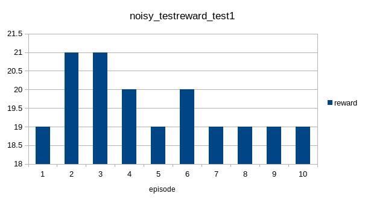
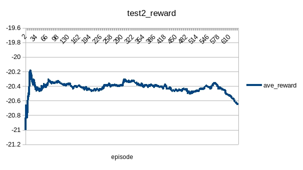
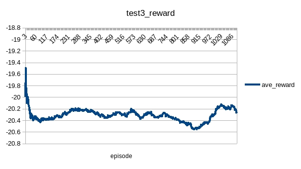

# NoisyDqn
## Pong
### test1
|name|value|
|----|-----|
|rbCap|100000|
|learningRate|1e-4|
|Optimizer|Adam|
|targetUpdateStep|1000|
|inputScale|256|
|rewardScale|1|
|rewardMin|-1|
|rewardMax|1|
|gamma|0.99|
|batchSize|128|
|startStep|10000|
|maxGradNormClip|1|
|updateStep|927000|

The training result:

The test result:

### test2
|name|value|
|----|-----|
|rbCap|10240|
|learningRate|1e-4|
|Optimizer|RMSprop|
|targetUpdateStep|1000|
|inputScale|256|
|rewardScale|1|
|rewardMin|-1|
|rewardMax|1|
|gamma|0.99|
|batchSize|128|
|startStep|10000|
|maxGradNormClip|1|
|updateStep|541000|

The result is bad:

### test3
|name|value|
|----|-----|
|rbCap|100000|
|learningRate|1e-4|
|Optimizer|RMSprop|
|targetUpdateStep|1024|
|inputScale|256|
|rewardScale|1|
|rewardMin|-1|
|rewardMax|1|
|gamma|0.99|
|batchSize|128|
|startStep|10000|
|maxGradNormClip|1|
|updateStep|1e+6|

## Conclusion
* Optimizer weights in these tests
* NoisyDqn has less hyper-parameters to be tuned, but the computation is very costly. It is far more slow than other Dqn algorithm.   

