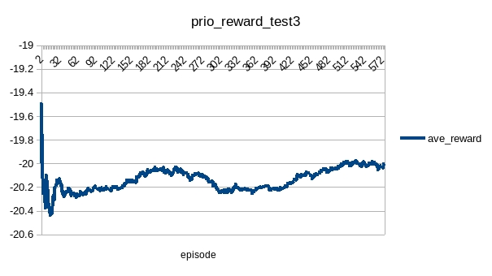

# PrioDqn
## Test Cases
### testPong0
|name|value|
|----|-----|
|rbCap|8192 * 8|
|targetUpdateStep|1000|
|learningRate|0.00025|
|Optimizer|RMSprop|
|pbAlpha|0.6|
|pbBetaBegin|0.4|
|pbBetaEnd|1|
|pbEpsilon|1e-3|
|pbBetaPart|0.9|
|exploreBegin|1|
|exploreEnd|0.01|
|explorePart|0.8|
|inputScale|256|
|rewardScale|1|
|rewardMin|-1|
|rewardMax|1|
|gamma|0.99|
|batchSize|32|
|startStep|8192|
|maxGradNormClip|1|
|updateStep|1e+6|

### testPong1
|name|value|
|----|-----|
|rbCap|8192 * 4|
|targetUpdateStep|5000|
|learningRate|0.00025|
|Optimizer|RMSprop|
|pbAlpha|0.6|
|pbBetaBegin|1|
|pbBetaEnd|1|
|pbEpsilon|1e-6|
|pbBetaPart|0.9|
|exploreBegin|1|
|exploreEnd|0.1|
|explorePart|0.5|
|inputScale|256|
|rewardScale|1|
|rewardMin|-1|
|rewardMax|1|
|gamma|0.99|
|batchSize|128|
|startStep|8192|
|maxGradNormClip|1|
|updateStep|1e+6|

Continue training model generated by test0 with almost bad choice for all parameters. Just slim better than test0:

### testPong2
|name|value|
|----|-----|
|rbCap|8192 * 8|
|targetUpdateStep|1000|
|learningRate|0.0001|
|Optimizer|RMSprop|
|pbAlpha|0.6|
|pbBetaBegin|1|
|pbBetaEnd|1|
|pbEpsilon|1e-6|
|pbBetaPart|0.9|
|exploreBegin|1|
|exploreEnd|0.01|
|explorePart|0.8|
|inputScale|256|
|rewardScale|1|
|rewardMin|-1|
|rewardMax|1|
|gamma|0.99|
|batchSize|128|
|startStep|100|
|maxGradNormClip|1|
|updateStep|1.554e+6|

Recover setting of test0 except Beta. Putting too much priority weights at beginning drives training to sub-optimal trap.

### testPong3
|name|value|
|----|-----|
|rbCap|8192 * 8|
|targetUpdateStep|1000|
|learningRate|1e-3|
|Optimizer|Adam|
|pbAlpha|0.6|
|pbBetaBegin|0.4|
|pbBetaEnd|1|
|pbEpsilon|1e-3|
|pbBetaPart|0.9|
|exploreBegin|1|
|exploreEnd|0.01|
|explorePart|0.8|
|inputScale|256|
|rewardScale|1|
|rewardMin|-1|
|rewardMax|1|
|gamma|0.99|
|batchSize|32|
|startStep|100|
|maxGradNormClip|1|
|updateStep|546000|

Recover setting of *Beta*. In fact, test3 is the same as test0, while got worse performance.

### testPong4
|name|value|
|----|-----|
|rbCap|8192 * 8|
|targetUpdateStep|1000|
|learningRate|0.00025|
|Optimizer|RMSprop|
|pbAlpha|0.6|
|pbBetaBegin|0.4|
|pbBetaEnd|1|
|pbEpsilon|1e-3|
|pbBetaPart|1|
|exploreBegin|1|
|exploreEnd|0.01|
|explorePart|0.8|
|inputScale|256|
|rewardScale|1|
|rewardMin|-1|
|rewardMax|1|
|gamma|0.99|
|batchSize|32|
|startStep|100|
|maxGradNormClip|1|
|updateStep|4e+6|

Extends *pbBetaEnd* to 1, with more training steps:

Test result:

### testPong5
|name|value|
|----|-----|
|rbCap|8192 * 8|
|targetUpdateStep|1000|
|learningRate|0.00025|
|Optimizer|RMSprop|
|pbAlpha|0.6|
|pbBetaBegin|0.9|
|pbBetaEnd|1|
|pbEpsilon|1e-3|
|pbBetaPart|1|
|exploreBegin|0.1|
|exploreEnd|0.01|
|explorePart|0.8|
|inputScale|256|
|rewardScale|1|
|rewardMin|-1|
|rewardMax|1|
|gamma|0.99|
|batchSize|32|
|startStep|100|
|maxGradNormClip|1|
|updateStep|500000|

Continue training model generated by test4. Decrease *Beta* and *exploreBegin* to adjust to more stable training:

Test result improved compared to that of test4.

### testPong6
|name|value|
|----|-----|
|rbCap|8192 * 8|
|targetUpdateStep|1000|
|learningRate|0.00025|
|Optimizer|RMSprop|
|pbAlpha|0.6|
|pbBetaBegin|0.9|
|pbBetaEnd|1|
|pbEpsilon|1e-3|
|pbBetaPart|1|
|exploreBegin|0.1|
|exploreEnd|0.01|
|explorePart|0.8|
|inputScale|256|
|rewardScale|1|
|rewardMin|-1|
|rewardMax|1|
|gamma|0.99|
|batchSize|32|
|startStep|100|
|maxGradNormClip|1|
|updateStep|500000|

Continue training model generated by test5, constraint exploration in small space with small explore epsilon and large beta.

Training data lost. The test result is worse than that of test5.

### testPong7
|name|value|
|----|-----|
|rbCap|8192 * 4|
|targetUpdateStep|5000|
|learningRate|1e-4|
|Optimizer|Adam|
|pbAlpha|0.6|
|pbBetaBegin|0.6|
|pbBetaEnd|1|
|pbEpsilon|1e-6|
|pbBetaPart|1|
|exploreBegin|0.2|
|exploreEnd|0.1|
|explorePart|1|
|inputScale|256|
|rewardScale|1|
|rewardMin|-1|
|rewardMax|1|
|gamma|0.99|
|batchSize|128|
|startStep|100|
|maxGradNormClip|1|
|updateStep|400000|

Continue training model generated by test6 with different optimizer. The trial failed. 

The test result is less than 10 per episode.

### testPong8
|name|value|
|----|-----|
|rbCap|8192 * 4|
|targetUpdateStep|5000|
|learningRate|1e-4|
|Optimizer|Adam|
|pbAlpha|0.6|
|pbBetaBegin|0.6|
|pbBetaEnd|0.9|
|pbEpsilon|1e-6|
|pbBetaPart|1|
|exploreBegin|0.1|
|exploreEnd|0.1|
|explorePart|1|
|inputScale|256|
|rewardScale|1|
|rewardMin|-1|
|rewardMax|1|
|gamma|0.99|
|batchSize|128|
|startStep|100|
|maxGradNormClip|1|
|updateStep|400000|

Continue training model generated by test7 with exploration fixed at 0.1.

The small exploration space led to bad performance:

### testPong9
|name|value|
|----|-----|
|rbCap|8192 * 4|
|targetUpdateStep|5000|
|learningRate|1e-4|
|Optimizer|Adam|
|targetUpdateStep|5000|
|pbAlpha|0.6|
|pbBetaBegin|0.9|
|pbBetaEnd|0.9|
|pbEpsilon|1e-6|
|pbBetaPart|1|
|exploreBegin|0.1|
|exploreEnd|0.1|
|explorePart|1|
|inputScale|256|
|rewardScale|1|
|rewardMin|-1|
|rewardMax|1|
|gamma|0.99|
|batchSize|128|
|startStep|100|
|maxGradNormClip|1|
|updateStep|?|

Continue training model generated by test7 with big beta fixed at 0.9.

The training data lost. Test result indicated the performance recovered:

### testPong10
|name|value|
|----|-----|
|rbCap|8192 * 4|
|targetUpdateStep|5000|
|learningRate|1e-4|
|Optimizer|Adam|
|targetUpdateStep|5000|
|pbAlpha|0.6|
|pbBetaBegin|0.9|
|pbBetaEnd|0.9|
|pbEpsilon|1e-6|
|pbBetaPart|1|
|exploreBegin|0.1|
|exploreEnd|0.1|
|explorePart|1|
|inputScale|256|
|rewardScale|1|
|rewardMin|-1|
|rewardMax|1|
|gamma|0.99|
|batchSize|128|
|startStep|100|
|maxGradNormClip|1|
|updateStep|?|

Continue training model generated by test9. Data lost.

### testPong11
|name|value|
|----|-----|
|rbCap|8192 * 4|
|targetUpdateStep|5000|
|learningRate|1e-4|
|Optimizer|Adam|
|targetUpdateStep|5000|
|pbAlpha|0.6|
|pbBetaBegin|0.9|
|pbBetaEnd|0.9|
|pbEpsilon|1e-6|
|pbBetaPart|1|
|exploreBegin|0.1|
|exploreEnd|0.05|
|explorePart|1|
|inputScale|256|
|rewardScale|1|
|rewardMin|-1|
|rewardMax|1|
|gamma|0.99|
|batchSize|128|
|startStep|100|
|maxGradNormClip|1|
|updateStep|39000|

Continue training model generated by test9. The test aborted.

