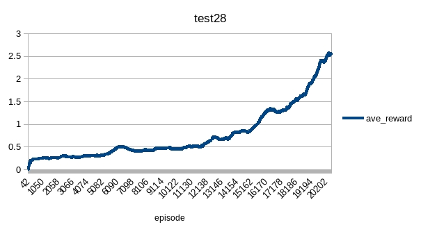
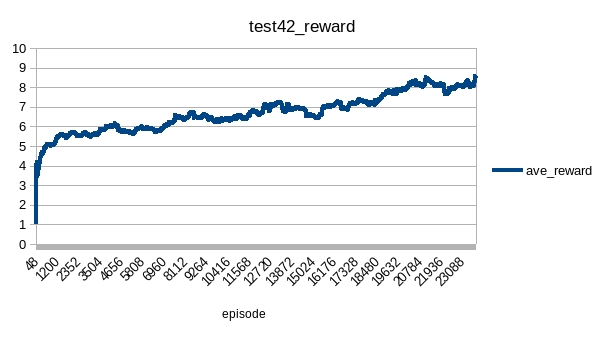

# PPO2 Breakout

## Tests
### test1
|name|value|
|----|-----|
|entropyCoef|0.01|
|valueCoef|0.5|
|maxGradNormClip|0.5|
|gamma|0.99|
|lambda|0.95|
|epsilon|0.1|
|epochNum|10|
|envNum|50|
|batchSize|32 * 50|
|trajStep|32 * 4|
|reward|[-1,1]|
|model|AirACHONet|
|optimizer|Adam|
|Adam.lr|1e-3|
|algTemplate|PPOShared|

Data lost.

### test2/test3
|name|value|
|----|-----|
|entropyCoef|0.01|
|valueCoef|0.5|
|maxGradNormClip|0.5|
|gamma|0.99|
|lambda|0.95|
|epsilon|0.1|
|epochNum|10|
|envNum|50|
|batchSize|32 * 50|
|trajStep|32 * 2|
|reward|[-1,1]|
|model|AirACHONet|
|optimizer|Adam|
|Adam.lr|1e-3|
|algTemplate|PPOShared|
|update|256|

It was learning, but slowly. The study is always increasing slowly at the beginning (when average reward is small)

###  test4 ~ test26
Pong had proved that *PPOShared* template did not work. All cases of test1 ~ test26 also proved it did not work for Breakout.

### test27
Error

### test28
|name|value|
|----|-----|
|entropyCoef|0.01|
|valueCoef|0.25|
|maxGradNormClip|0.5|
|gamma|0.99|
|lambda|0.95|
|ppoEpsilon|0.1|
|epochNum|1|
|envNum|50|
|batchSize|20 * 50|
|trajStep|20 * 1|
|reward|[-1,1]|
|model|AirACHONet|
|optimizer|RMSprop|
|RMSprop.lr|7e-4|
|RMSprop.eps|1e-5|
|RMSprop.alpha|0.99|
|algTemplate|PPORandom|
|update|1024|

Set epochNum = 1, batch step == trajectory step, it was an A2C case with GAE return. 

### test29
Continue training the model generated by test28. The algorithm worked in A2C case.

### test30
|name|value|
|----|-----|
|entropyCoef|0.01|
|valueCoef|0.25|
|maxGradNormClip|0.5|
|gamma|0.99|
|lambda|0.95|
|ppoEpsilon|0.1|
|epochNum|2|
|envNum|50|
|batchSize|20 * 50|
|trajStep|20 * 1|
|reward|[-1,1]|
|model|AirACHONet|
|optimizer|RMSprop|
|RMSprop.lr|7e-4|
|RMSprop.eps|1e-5|
|RMSprop.alpha|0.99|
|algTemplate|PPORandom|
|update|1024|

Increased epochNum. The reward is unstable. Policy loss was not balanced (mean = 0). There was something wrong in epoch parts. 

### test31
|name|value|
|----|-----|
|entropyCoef|0.01|
|valueCoef|0.25|
|maxGradNormClip|0.5|
|gamma|0.99|
|lambda|0.95|
|ppoEpsilon|0.1|
|epochNum|1|
|envNum|50|
|batchSize|20 * 50|
|trajStep|20 * 2|
|reward|[-1,1]|
|model|AirACHONet|
|optimizer|RMSprop|
|RMSprop.lr|7e-4|
|RMSprop.eps|1e-5|
|RMSprop.alpha|0.99|
|algTemplate|PPORandom|
|update|2048|

epochNum remained 1, batch number (not batch size) increased into 2.

It was still not stable. There was something in multi-batch calculation.

### test32
|name|value|
|----|-----|
|entropyCoef|0.01|
|valueCoef|0.25|
|maxGradNormClip|0.5|
|gamma|0.99|
|lambda|0.95|
|ppoEpsilon|0.1|
|epochNum|10|
|envNum|50|
|batchSize|10 * 50|
|trajStep|10 * 4|
|reward|[-1,1]|
|model|AirACHONet|
|optimizer|RMSprop|
|RMSprop.lr|7e-4|
|RMSprop.eps|1e-5|
|RMSprop.alpha|0.99|
|algTemplate|PPORandom|
|update|1024|

Tried brute force to show that test31/test30 was not caused by lack of samples, but test32 was not trained with enough updates that average reward = 4.5 did not reach the reward threshold that led to ramatic drop.

### test33
|name|value|
|----|-----|
|entropyCoef|0.01|
|valueCoef|0.25|
|maxGradNormClip|0.5|
|gamma|0.99|
|lambda|0.95|
|ppoEpsilon|0.1|
|epochNum|10|
|envNum|50|
|batchSize|10 * 50|
|trajStep|10 * 10|
|reward|[-1,1]|
|model|AirACHONet|
|optimizer|Adam|
|Adam.lr|1e-4|
|algTemplate|PPORandom|
|update|1024|

It is declared that Adam is better than RMS for PPO. Tried Adam on model generated by test32. It was indeed more stable compared to reward of test31.

### test34
|name|value|
|----|-----|
|entropyCoef|0.01|
|valueCoef|0.25|
|maxGradNormClip|0.5|
|gamma|0.99|
|lambda|0.95|
|ppoEpsilon|0.1|
|epochNum|10|
|envNum|50|
|batchSize|10 * 50|
|trajStep|10 * 8|
|reward|[-1,1]|
|model|AirACHONet|
|optimizer|Adam|
|Adam.lr|1e-4|
|algTemplate|PPORandom|
|update|1024|

Applied Adam from very start.

Not bad, not good as expected:

### test35
|name|value|
|----|-----|
|entropyCoef|0.01|
|valueCoef|0.25|
|maxGradNormClip|0.5|
|gamma|0.99|
|lambda|0.95|
|ppoEpsilon|0.1|
|epochNum|10|
|envNum|50|
|batchSize|10 * 50|
|trajStep|10 * 4|
|reward|[-1,1]|
|model|AirACHONet|
|optimizer|Adam|
|Adam.lr|1e-4|
|algTemplate|PPORandom|
|update|1024|

Previous implementation only shuffled once per update. This implementation re-shuffled per epoch.
The return target estimation has been changed into TD(λ) estimation.

The reward result was better than that of test34.

### test36
|name|value|
|----|-----|
|entropyCoef|0.01|
|valueCoef|0.25|
|maxGradNormClip|0.5|
|gamma|0.99|
|lambda|0.9|
|ppoEpsilon|0.1|
|epochNum|10|
|envNum|50|
|batchSize|10 * 50|
|trajStep|10 * 4|
|reward|[-1,1]|
|normalReward|false|
|model|AirACHONet|
|optimizer|Adam|
|Adam.lr|1e-5|
|algTemplate|PPORandom|
|update|2048|

The book (Sutton) showed that best result got when λ = 0.8. So, test smaller λ and learning rate.

The max average reward was about 2.5, hard to decide if it was good.

### test37
|name|value|
|----|-----|
|entropyCoef|0.01|
|valueCoef|0.25|
|maxGradNormClip|0.5|
|gamma|0.99|
|lambda|0.95|
|ppoEpsilon|0.1|
|epochNum|10|
|envNum|50|
|batchSize|10 * 50|
|trajStep|10 * 4|
|reward|[-1,1]|
|normalReward|false|
|model|AirACHONet|
|optimizer|Adam|
|Adam.lr|1e-5|
|algTemplate|PPORandom|
|update|1024|

Continue training model generated by test36 with default λ. The result was not bad, but not good enough.

### test38/test39
|name|value|
|----|-----|
|entropyCoef|0.01|
|valueCoef|0.25|
|maxGradNormClip|0.5|
|gamma|0.99|
|lambda|0.95|
|ppoEpsilon|0.1|
|epochNum|10|
|envNum|50|
|batchSize|10 * 50|
|trajStep|10 * 4|
|reward|[-1,1]|
|normalReward|false|
|model|AirACHONet|
|optimizer|Adam|
|Adam.lr|1e-5|
|algTemplate|PPORandom|
|update|1024|

Continue training model generated by test37. Not promising.

### test40
|name|value|
|----|-----|
|entropyCoef|0.01|
|valueCoef|0.25|
|maxGradNormClip|0.5|
|gamma|0.99|
|lambda|0.9|
|ppoEpsilon|0.1|
|epochNum|10|
|envNum|50|
|batchSize|10 * 50|
|trajStep|10 * 4|
|reward|[-1,1]|
|normalReward|false|
|model|AirACHONet|
|optimizer|Adam|
|Adam.lr|1e-5|
|algTemplate|PPORandom|
|update|2048|

Continue training model generated by test36 with λ = 0.9.

### test41
Don't know what this case for

### test42/test43/test46/test48
|name|value|
|----|-----|
|entropyCoef|0.01|
|valueCoef|0.25|
|maxGradNormClip|0.5|
|gamma|0.99|
|lambda|0.9|
|ppoEpsilon|0.1|
|epochNum|10|
|envNum|50|
|batchSize|10 * 50|
|trajStep|10 * 4|
|reward|[-1,1]|
|normalReward|false|
|model|AirACHONet|
|optimizer|Adam|
|Adam.lr|1e-5|
|algTemplate|PPORandom|
|update|2048|

Continue training model generated by test40. Seemed too small learning rate.

### test44/test45/test47/test49/test52
|name|value|
|----|-----|
|entropyCoef|0.01|
|valueCoef|0.5|
|maxGradNormClip|0.5|
|gamma|0.99|
|lambda|0.9|
|ppoEpsilon|0.1|
|epochNum|4|
|envNum|4|
|batchSize|16 * 8|
|trajStep|16 * 8|
|reward|[-1,1]|
|normalReward|false|
|model|AirACHONet|
|optimizer|Adam|
|Adam.lr|2.5e-4|
|algTemplate|PPORandom|
|update|2048|

Take SB3 Zoo default parameters. Seemed OK but not able to go beyond 50.

The test result:

### test50/test51
|name|value|
|----|-----|
|entropyCoef|0.01|
|valueCoef|0.5|
|maxGradNormClip|0.5|
|gamma|0.99|
|lambda|0.9|
|ppoEpsilon|0.1|
|epochNum|4|
|envNum|4|
|batchSize|16 * 8|
|trajStep|16 * 8|
|reward|[-1,1]|
|normalReward|false|
|model|AirACHONet|
|optimizer|Adam|
|Adam.lr|1e-4|
|algTemplate|PPORandom|
|update|2048|

Continue training model generated by test47 with smaller learning rate. Seemed better than that of test49. But no further update after 50 reached. 

But the entropy indicated that it maybe be because of high learning rate:

### test53
|name|value|
|----|-----|
|entropyCoef|0.02|
|valueCoef|0.5|
|maxGradNormClip|0.5|
|gamma|0.99|
|lambda|0.9|
|ppoEpsilon|0.1|
|epochNum|4|
|envNum|4|
|batchSize|16 * 8|
|trajStep|16 * 8|
|reward|[-1,1]|
|normalReward|false|
|model|AirACHONet|
|optimizer|Adam|
|Adam.lr|1e-4|
|algTemplate|PPORandom|
|update|1024|

Continue training on model generated by test51. Tried increase entropy_coef to push the agent to explore more rewarding actions. Not worked.

### test54
|name|value|
|----|-----|
|entropyCoef|0.005|
|valueCoef|0.5|
|maxGradNormClip|0.5|
|gamma|0.99|
|lambda|0.9|
|ppoEpsilon|0.1|
|epochNum|4|
|envNum|4|
|batchSize|16 * 8|
|trajStep|16 * 8|
|reward|[-1,1]|
|normalReward|false|
|model|AirACHONet|
|optimizer|Adam|
|Adam.lr|1e-4|
|algTemplate|PPORandom|
|update|1024|

Continue training on model generated by test51. Tried decrease entropy_coef to push the agent fix to explore more rewarding actions. Not worked.

### test55
|name|value|
|----|-----|
|entropyCoef|0.01|
|valueCoef|0.5|
|maxGradNormClip|0.5|
|gamma|0.99|
|lambda|0.9|
|ppoEpsilon|0.1|
|epochNum|10|
|envNum|50|
|batchSize|16 * 8|
|trajStep|16 * 8|
|reward|[-1,1]|
|normalReward|false|
|model|AirACHONet|
|optimizer|Adam|
|Adam.lr|1e-4|
|algTemplate|PPORandom|
|update|1024|

More envNum to continue training model generated by test42. It was better than result of test42/test48. More envNum always generated better result.

### test56
|name|value|
|----|-----|
|entropyCoef|0.005|
|valueCoef|0.5|
|maxGradNormClip|0.5|
|gamma|0.99|
|lambda|0.9|
|ppoEpsilon|0.1|
|epochNum|10|
|envNum|4|
|batchSize|16 * 8|
|trajStep|16 * 8|
|reward|[-1,1]|
|normalReward|false|
|model|AirACHONet|
|optimizer|Adam|
|Adam.lr|1e-4|
|algTemplate|PPOPenalty|
|update|1024|
|penalStep|350|
|penalReward|-0.5|

Sometimes, the agent hangs as it learned how to keep living instead of hit the brick and keep living at the same time. 
The PPOPenalty gives penalty reward if the agent got 0 reward for long successive steps. 

Seemed that negative penalty restraint the agent from exploring positive reward, it would be more likely to settle down on 0 reward actions.

### test57

