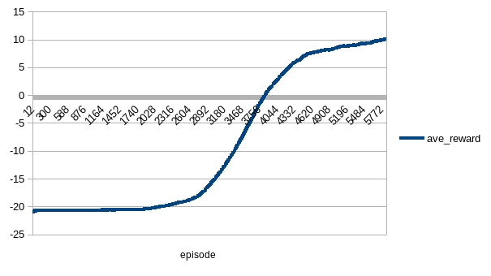
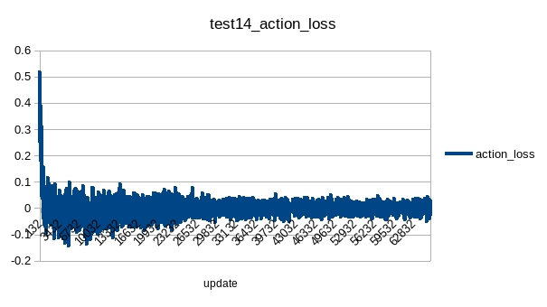

# PPO Pong

## Test
Batch size = *option.batchSize* * *option.envNum*;
### test1
|name|value|
|----|-----|
|entropyCoef|0.01|
|valueCoef|0.5|
|maxGradNormClip|0.5|
|gamma|0.99|
|lambda|0.95|
|epsilon|0.1|
|epochNum|10|
|envNum|50|
|batchSize|32 * 50|
|trajStep|200|
|model|AirACCnnNet|
|optimizer|Adam|
|Adam.lr|1e-3|
|algTemplate|PPOShared|

The reward shows it is promising:

### test2
|name|value|
|----|-----|
|entropyCoef|0.01|
|valueCoef|0.25|
|maxGradNormClip|0.5|
|gamma|0.99|
|lambda|0.95|
|epsilon|0.1|
|epochNum|10|
|envNum|50|
|batchSize|32 * 50|
|trajStep|32 * 4|
|model|AirACCnnNet|
|optimizer|Adam|
|Adam.lr|1e-3|
|algTemplate|PPOShared|

Training encountered a possible catastrophic forgetting.

Compared with test1, it may be caused by less *valueCoef* or smaller buffer size(trajStep) or overfitting.

### test3
|name|value|
|----|-----|
|entropyCoef|0.01|
|valueCoef|0.25|
|maxGradNormClip|0.5|
|gamma|0.99|
|lambda|0.95|
|epsilon|0.1|
|epochNum|20|
|envNum|50|
|batchSize|32 * 50|
|trajStep|32 * 4|
|model|AirACCnnNet|
|optimizer|Adam|
|Adam.lr|1e-3|
|algTemplate|PPOShared|

*envNum* increased.

The training has been trapped at 10. The action_loss was larger than expected and entropy showed that the agent was reluctant to explore.

### test4
Continue training on model generated by test3.

The agent learned slowly but average reward was increasing.

### test5
|name|value|
|----|-----|
|entropyCoef|0.01|
|valueCoef|0.25|
|maxGradNormClip|0.5|
|gamma|0.99|
|lambda|0.95|
|epsilon|0.1|
|epochNum|20|
|envNum|50|
|batchSize|32 * 50|
|trajStep|32 * 4|
|klEarlyStop|true|
|maxKlDelta|0.01|
|model|AirACCnnNet|
|optimizer|Adam|
|Adam.lr|1e-3|
|algTemplate|PPOShared|

Continue training on model generated by test4. Suppose the less the gap between reward and max reward(21), the finer tuning required.
So, test5 had klEarlyStop set as true.

While still a catastrophic drop when certain number of episodes trained (with episodes trained in test4/3 taken into account)

### test6
|name|value|
|----|-----|
|entropyCoef|0.01|
|valueCoef|0.25|
|maxGradNormClip|0.5|
|gamma|0.99|
|lambda|0.95|
|epsilon|0.1|
|epochNum|20|
|envNum|50|
|batchSize|32 * 50|
|trajStep|32 * 4|
|klEarlyStop|true|
|maxKlDelta|0.01|
|valueClip|true|
|maxValueDelta|1|
|model|AirACCnnNet|
|optimizer|Adam|
|Adam.lr|1e-3|
|algTemplate|PPOShared|

Continue training on model generated by test4. Introduced value clip and KL early stop to apply more constraint on update.

The reward showed a small improvement.

### test7
Continue training on model generated by test6.

Compare with test5, there was a dramatic drop in reward, but recovered quickly.
The value loss and entropy did not huge value during this (dramatic drop) span, but action loss was larger than expected during overall training period.

The test result is not bad:

### test8
Continue training on model generated by test7. No improvement.

### test9
Remove gae normalization(-mean / std) to make the model more value sensitive. It did not work but training data lost.

### test10
|name|value|
|----|-----|
|entropyCoef|0.01|
|valueCoef|0.25|
|maxGradNormClip|0.5|
|gamma|0.99|
|lambda|0.95|
|epsilon|0.1|
|epochNum|20|
|envNum|50|
|batchSize|32 * 50|
|trajStep|32 * 4|
|klEarlyStop|true|
|maxKlDelta|0.01|
|valueClip|true|
|maxValueDelta|1|
|model|AirACCnnNet|
|optimizer|Adam|
|Adam.lr|1e-3|
|algTemplate|PPORandom|

Break relevance between input samples by PPORandom.

It worked, and the training was quicker than test1.

### test11
|name|value|
|----|-----|
|entropyCoef|0.01|
|valueCoef|0.5|
|maxGradNormClip|0.5|
|gamma|0.99|
|lambda|0.95|
|epsilon|0.1|
|epochNum|10|
|envNum|50|
|batchSize|32 * 50|
|trajStep|10 * 10|
|klEarlyStop|true|
|maxKlDelta|0.01|
|valueClip|true|
|maxValueDelta|1|
|model|AirACHONet|
|optimizer|Adam|
|Adam.lr|1e-3|
|algTemplate|PPORandom|
|update|442|

Used model of AirACHONet. It was better than AirACCnnNet as indicated by test11 V.S. test10.

The entropy was unexpected high:

### test12
|name|value|
|----|-----|
|entropyCoef|0.005|
|valueCoef|0.25|
|maxGradNormClip|0.5|
|gamma|0.99|
|lambda|0.95|
|epsilon|0.1|
|epochNum|10|
|envNum|50|
|batchSize|32 * 50|
|trajStep|10 * 10|
|klEarlyStop|true|
|maxKlDelta|0.01|
|valueClip|true|
|maxValueDelta|1|
|model|AirACHONet|
|optimizer|Adam|
|Adam.lr|1e-3|
|algTemplate|PPORandom|

So to decrease entropyCoef into 0.005. Test data had been destroyed.

### test13
|name|value|
|----|-----|
|entropyCoef|0.002|
|valueCoef|0.5|
|maxGradNormClip|0.5|
|gamma|0.99|
|lambda|0.95|
|epsilon|0.1|
|epochNum|10|
|envNum|50|
|batchSize|4 * 50|
|trajStep|4 * 32|
|klEarlyStop|true|
|maxKlDelta|0.01|
|valueClip|true|
|maxValueDelta|1|
|model|AirACHONet|
|optimizer|Adam|
|Adam.lr|1e-3|
|algTemplate|PPORandom|
|update|512|

SB3 default parameters except that entropyCoef = 0.002.

The result is very good:

Although entropy was still high.

Test result:

### test14
|name|value|
|----|-----|
|entropyCoef|0.002|
|valueCoef|0.5|
|maxGradNormClip|0.5|
|gamma|0.99|
|lambda|0.95|
|epsilon|0.1|
|epochNum|10|
|envNum|50|
|batchSize|4 * 50|
|trajStep|4 * 32|
|klEarlyStop|true|
|maxKlDelta|0.01|
|valueClip|true|
|maxValueDelta|1|
|model|AirACHONet|
|optimizer|Adam|
|Adam.lr|1e-3|
|algTemplate|PPORandom|
|update|512|
|tdValue|false|

To try MC value target estimation instead of TD(λ) estimation. It was worse than that of TD estimation.

Test result:

### test13 VS. test14
It seemed that difference of figures of all the three parts of the loss function were more obvious at the beginning parts,
while it affected the ultimate reward of the test.  

Value loss:

Policy loss:

Entropy:

## Conclusion
* The rollout buffer has to be randomized: test1~9 V.S. test10~14
* SB3 zoo parameters worked very good.
* Entropy was high even in good solutions (even in SB3 default case).
* TD(λ) worked better than MC value estimation.

### PPO VS. A2C
In according to reward obtained in both training and test, PPO is better. PPO is also more data efficient.

The best average reward of A2C tests was obtained in test31.:

The best average reward of PPO was obtained in test13:

Also, PPO is more data efficient:

A2C took about 10,000 episodes to make reward increase from -21 to 10, as show in A2C test20:

The reward figure of test13 showed that PPO took < 1,700 episodes to make reward increase from -21 to > 20.