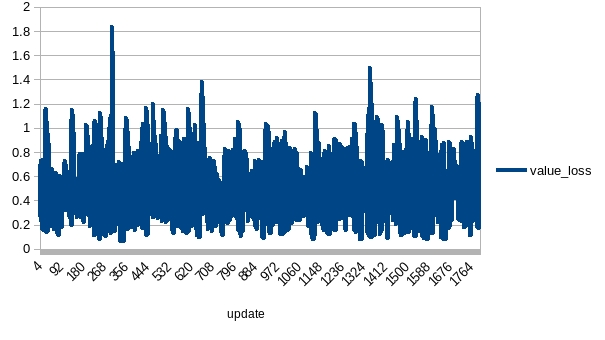

# PPO Pong

## Test
Batch size = *option.batchSize* * *option.envNum*;
### test1
|name|value|
|----|-----|
|entropyCoef|0.01|
|valueCoef|0.5|
|maxGradNormClip|0.5|
|gamma|0.99|
|lambda|0.95|
|epsilon|0.1|
|epochNum|10|
|envNum|50|
|batchSize|32 * 50|
|trajStep|200|
|model|AirACCnnNet|
|optimizer|Adam|
|Adam.lr|1e-3|
|algTemplate|PPOShared|

The reward shows it is promising:

### test2
|name|value|
|----|-----|
|entropyCoef|0.01|
|valueCoef|0.25|
|maxGradNormClip|0.5|
|gamma|0.99|
|lambda|0.95|
|epsilon|0.1|
|epochNum|10|
|envNum|50|
|batchSize|32 * 50|
|trajStep|32 * 4|
|model|AirACCnnNet|
|optimizer|Adam|
|Adam.lr|1e-3|
|algTemplate|PPOShared|

Training encountered a possible catastrophic forgetting.

Compared with test1, it may be caused by less *valueCoef* or smaller buffer size(trajStep) or overfitting.

### test3
|name|value|
|----|-----|
|entropyCoef|0.01|
|valueCoef|0.25|
|maxGradNormClip|0.5|
|gamma|0.99|
|lambda|0.95|
|epsilon|0.1|
|epochNum|20|
|envNum|50|
|batchSize|32 * 50|
|trajStep|32 * 4|
|model|AirACCnnNet|
|optimizer|Adam|
|Adam.lr|1e-3|
|algTemplate|PPOShared|

*envNum* increased.

The training has been trapped at 10. The action_loss was larger than expected and entropy showed that the agent was reluctant to explore.

### test4
Continue training on model generated by test3.

The agent learned slowly but average reward was increasing.

### test5
|name|value|
|----|-----|
|entropyCoef|0.01|
|valueCoef|0.25|
|maxGradNormClip|0.5|
|gamma|0.99|
|lambda|0.95|
|epsilon|0.1|
|epochNum|20|
|envNum|50|
|batchSize|32 * 50|
|trajStep|32 * 4|
|klEarlyStop|true|
|maxKlDelta|0.01|
|model|AirACCnnNet|
|optimizer|Adam|
|Adam.lr|1e-3|
|algTemplate|PPOShared|

Continue training on model generated by test4. Suppose the less the gap between reward and max reward(21), the finer tuning required.
So, test5 had klEarlyStop set as true.

While still a catastrophic drop when certain number of episodes trained (with episodes trained in test4/3 taken into account)

### test6
|name|value|
|----|-----|
|entropyCoef|0.01|
|valueCoef|0.25|
|maxGradNormClip|0.5|
|gamma|0.99|
|lambda|0.95|
|epsilon|0.1|
|epochNum|20|
|envNum|50|
|batchSize|32 * 50|
|trajStep|32 * 4|
|klEarlyStop|true|
|maxKlDelta|0.01|
|valueClip|true|
|maxValueDelta|1|
|model|AirACCnnNet|
|optimizer|Adam|
|Adam.lr|1e-3|
|algTemplate|PPOShared|

Continue training on model generated by test4. Introduced value clip and KL early stop to apply more constraint on update.

The reward showed a small improvement.

### test7
Continue training on model generated by test6.

Compare with test5, there was a dramatic drop in reward, but recovered quickly.
The value loss and entropy did not huge value during this (dramatic drop) span, but action loss was larger than expected during overall training period.

The test result is not bad:

### test8
Continue training on model generated by test7. No improvement.

### test9
Remove gae normalization(-mean / std) to make the model more value sensitive. It did not work but training data lost.

### test10
|name|value|
|----|-----|
|entropyCoef|0.01|
|valueCoef|0.25|
|maxGradNormClip|0.5|
|gamma|0.99|
|lambda|0.95|
|epsilon|0.1|
|epochNum|20|
|envNum|50|
|batchSize|32 * 50|
|trajStep|32 * 4|
|klEarlyStop|true|
|maxKlDelta|0.01|
|valueClip|true|
|maxValueDelta|1|
|model|AirACCnnNet|
|optimizer|Adam|
|Adam.lr|1e-3|
|algTemplate|PPORandom|

Break relevance between input samples by PPORandom.

It worked, and the training was quicker than test1.

Update:
entropy_breakout_0.01: update = (2048 iteration) * (128 trajectory step) / (16 batch step) * (4 epoch) = 65536
entropy_pong_0.01: update = (442 iteration) * (100 trajectory step) / (10 batch step) * (10 epoch) = 44200
entropy_pong_0.002: update = (512 iteration) * (128 trajectory step) / (4 batch step) * (4 epoch) = 65536 

