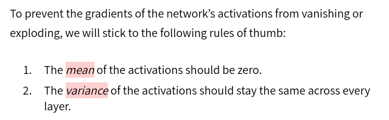
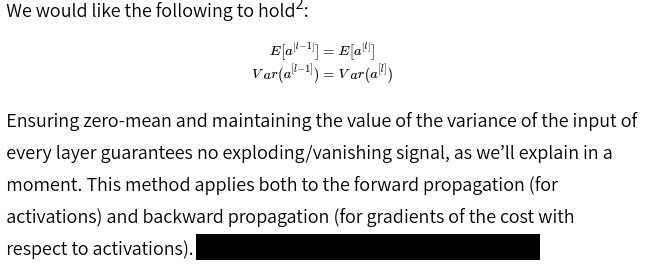

# General Knowledge

## Initiation
1. [Initiation introduction](https://www.deeplearning.ai/ai-notes/initialization/)

2. [Introduction of Xavier and Kaiming](https://towardsdatascience.com/weight-initialization-in-neural-networks-a-journey-from-the-basics-to-kaiming-954fb9b47c79)

3. [Math explaination](https://pouannes.github.io/blog/initialization/)

### Notes
According to ref(1):

And, 

Then Xavier recommended a 0-mean normal distribution for W initiation.

The ref(1) proved that:
* Suppose activation function = tanh and input of tanh in scope of active area, i.e., tanh(x) ≈ x.
* Xavier initiation match hold2 in above figure.
* Var(a) remains in scope of Var(x). a is output of a certain layer
* Var(a) holds without vanish or exploding through deep layers.

Ref(2) demonstrated a simple case to show that a two form of Xavier initiation gives similar effect:
* in form of uniform distribution bounded between

* in form of normal distribution like:

For layers with Relu as activation function, Kaiming initiation is recommended by ref(2).
Kaiming is exactly the second form mentioned above. Ref(2) presented an example to show where sqrt(2) came from.
Ref(2) also presented another example to show that Xavier failed in Relu case. 

Ref(3) explains math behind these algorithms (Xavier and Kaiming):
* Xavier treats activation function with linear approximation. It is not the case for Relu. 
* Kaiming takes Relu as example, as P(Relu(x)) = 1/2, there is sqrt(2) in Kaiming initiation.
* Backward prove is the same with forward process, except that the input is from layer(l + 1) instead of layerl-1
* Take both forward and backward in consideration, Xavier takes mean of input layer of each direction. Kaiming argues taking one direction in consideration is good enough.
### TODO
* Ref(1) declares Xavier is a normal distribution, Ref(2) declares it is a uniform one. To check the paper

