# SAC
## Reference
* [A demo](https://github.com/ku2482/sac-discrete.pytorch)

## Pacman
### Codes Tuning
To make my implement match that of  [demo](https://github.com/ku2482/sac-discrete.pytorch) mentioned above

|name|value|
|----|-----|
|envNum|1|
|targetUpdateStep|8,000|
|tau|1|
|rbCap|300,000|
|inputScale|255|
|rewardScale|1|
|rewardMin|-1|
|rewardMax|1|
|gamma|0.99|
|outputNum|9|
|batchSize|64|
|startStep|20,000|
|maxGradNormClip|1,000|
|testGapEp|10,000|
|tsetEp|3|
|testBatch|1|
|livePerEpisode|3|
|targetEntropyCoef|0.98|
|envStep|4|
|optimizer|Adam|
|lr|0.0003|

#### no init
NN without initialization:

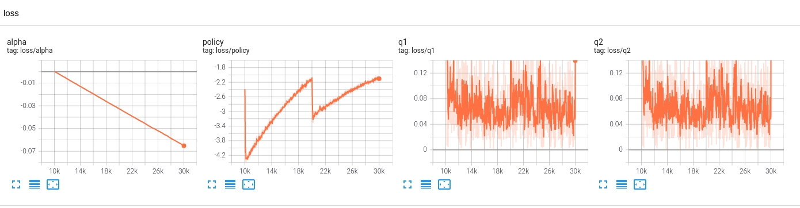

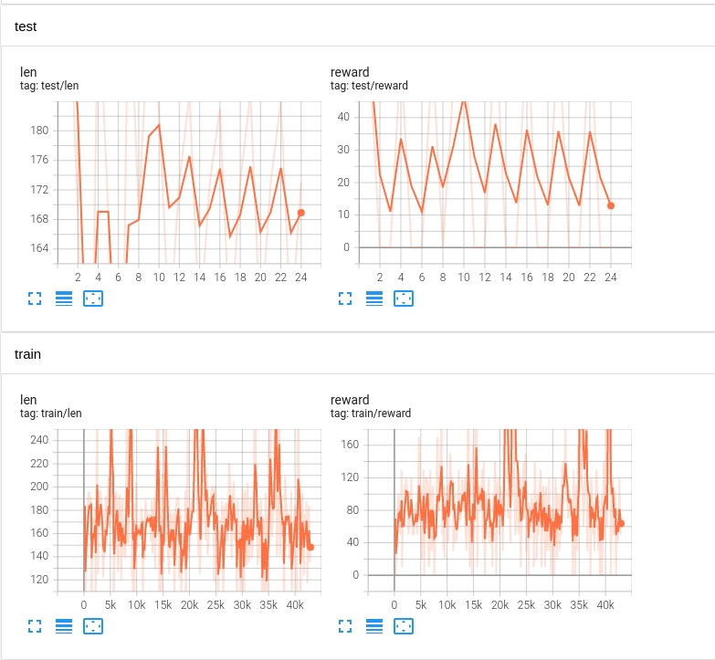

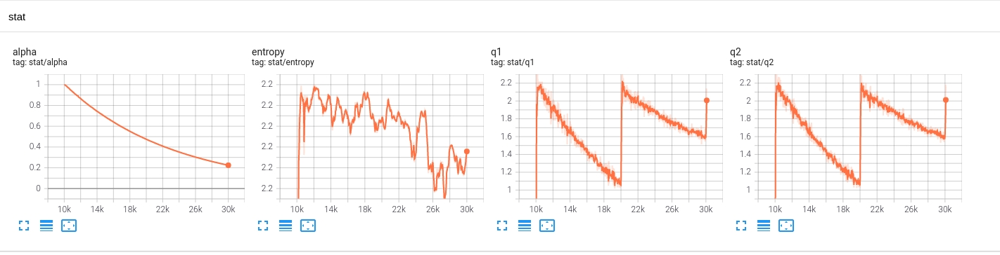

The loss and stats were not bad, but the reward is much worse than expected. 
Seemed that the uninitialized NN learned very slowly that the 30k steps were not enough for them to move to a steady learning phase.

#### init
NN with convolutional layers initialized by Kaiming and linear layers initialized by Kaiming 

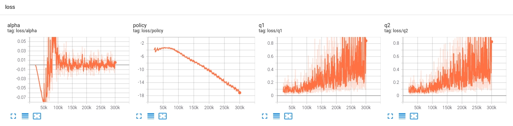

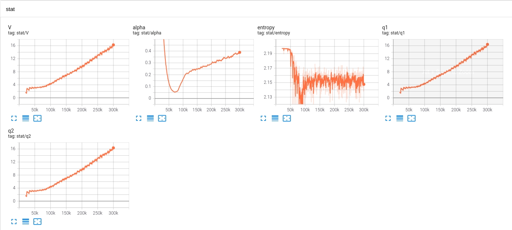

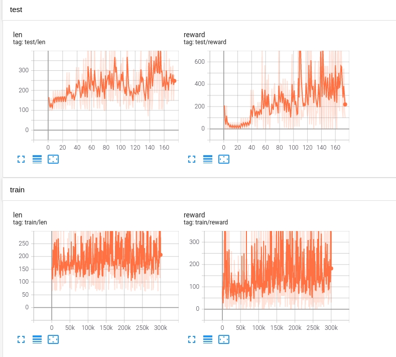

#### no linear init
NN with convolutional layers initialized by Kaiming and linear layeres initialized by xavier (pytorch default)

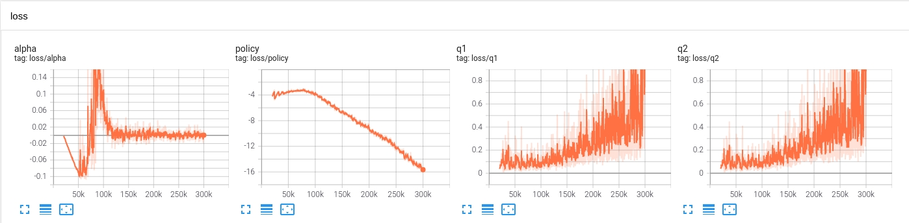

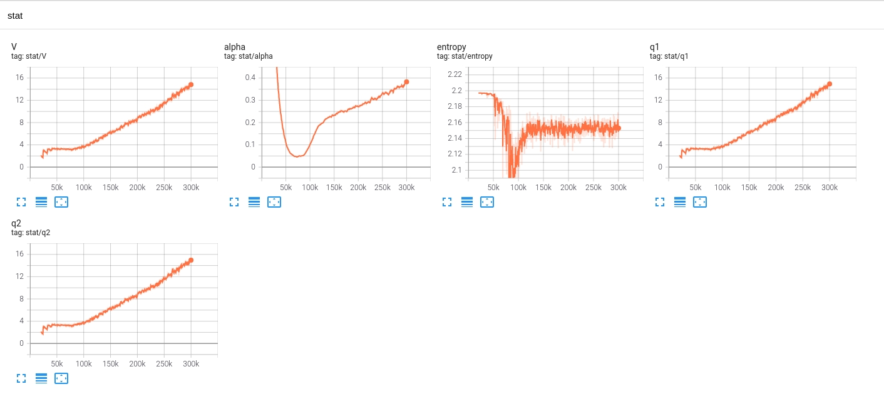

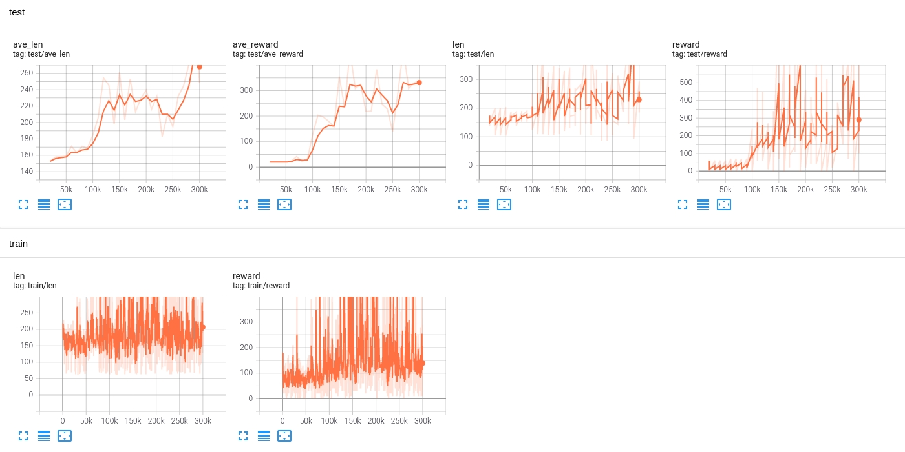

The reward in *init* case was shown by score per episode (3 lives per episode), reward in this case was shown by score per live. So this case was better.

#### no maxgrad
Update without clip_grad_norm_

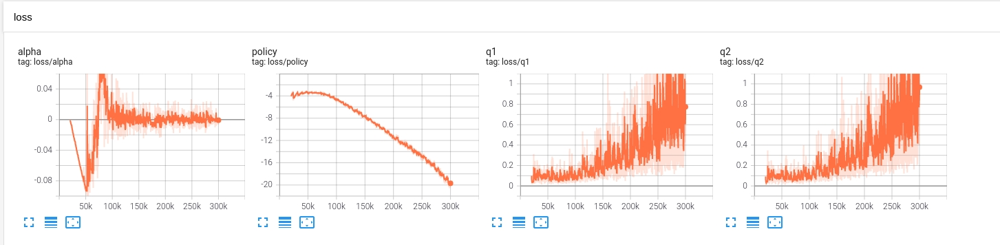

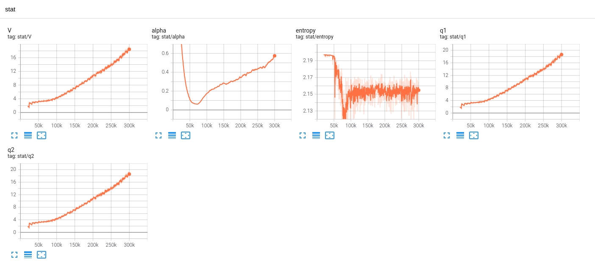

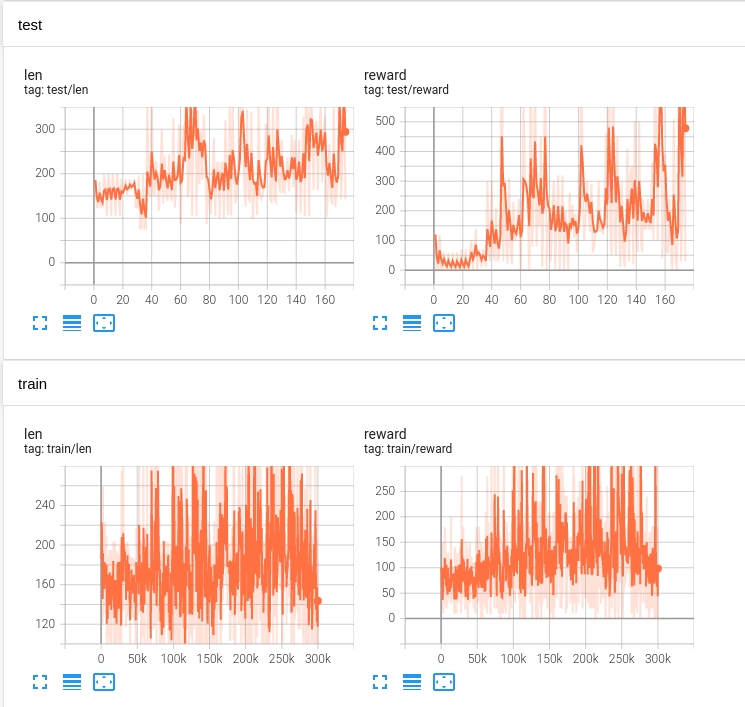

The reward is less stable and alpha was not going to converge. But following cases were all in no-max-grad-constraint condition.

#### 1m
When performance of 30k matched that of the demo, run the same case in 1m steps.

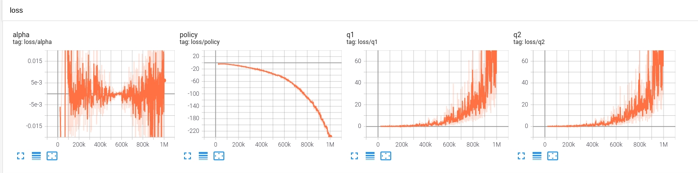

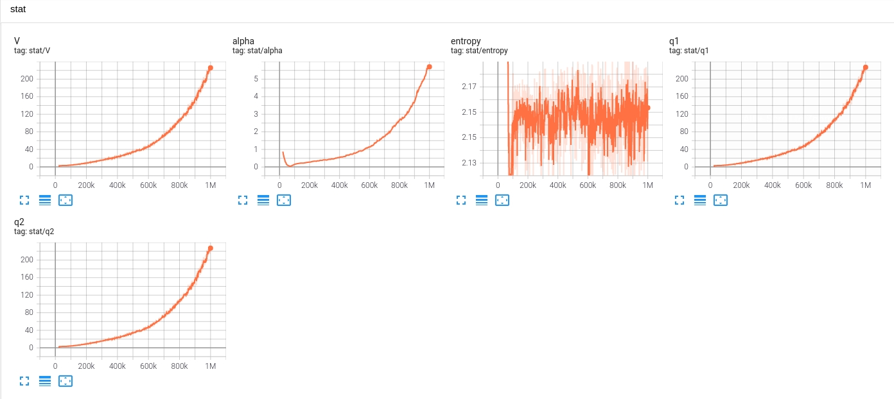

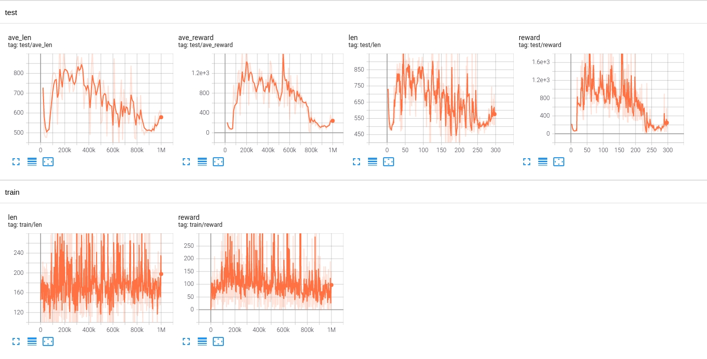

After about 500,000 steps, the agent stopped to learn. Seemed that the target entropy was too big that ideal entropy failed to remain around target entropy.

### test01
Try to scale the reward and Q by 2 to hope V/Q dominate the estimation. Failed

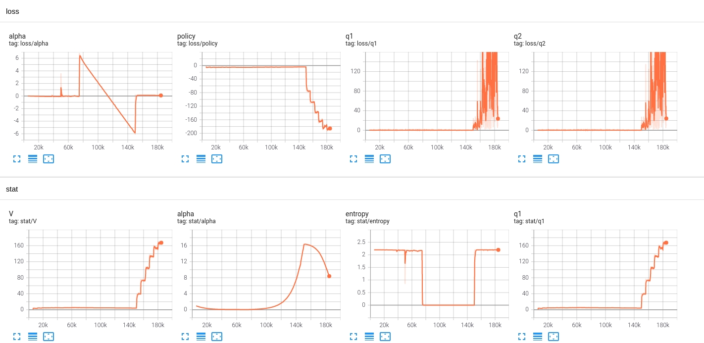

So 0.98 is really too much.

### test1
|name|value|
|----|-----|
|envNum|1|
|targetUpdateStep|8,000|
|tau|1|
|rbCap|300,000|
|inputScale|255|
|rewardScale|1|
|rewardMin|-1|
|rewardMax|1|
|gamma|0.99|
|outputNum|9|
|batchSize|64|
|startStep|20,000|
|maxGradNormClip|1,000|
|testGapEp|10,000|
|tsetEp|3|
|testBatch|1|
|livePerEpisode|3|
|targetEntropyCoef|0.90|
|envStep|4|
|optimizer|Adam|
|lr|0.0003|

To decrease targetEntropyCoef into 0.90. 

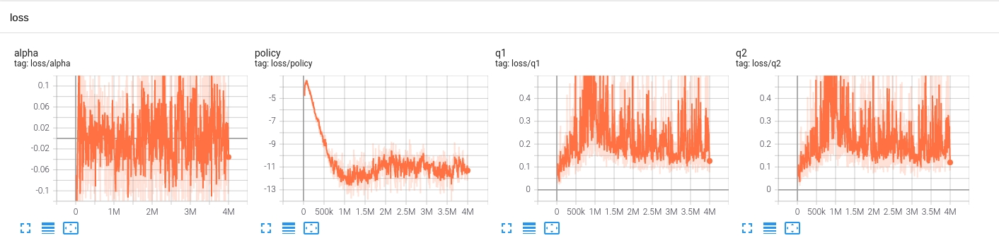

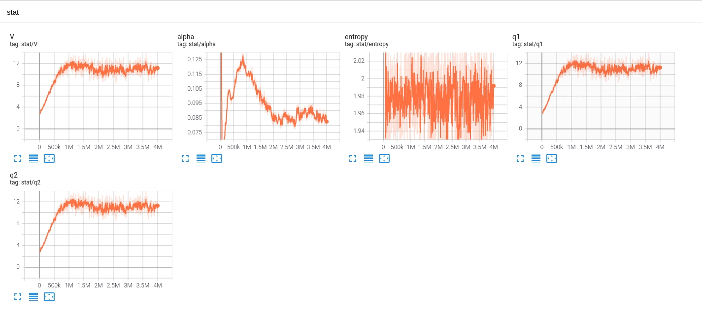

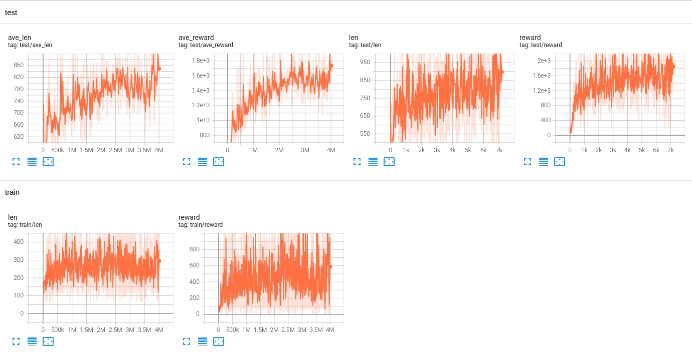

It was stable, but alpha kept decreasing in about 1M steps (1M ~ 2M). Maybe more steps generate more reward, or maybe bigger targetEntropyCoef to be tried.

### test11
|name|value|
|----|-----|
|envNum|1|
|targetUpdateStep|8,000|
|tau|1|
|rbCap|300,000|
|inputScale|255|
|rewardScale|2|
|rewardMin|-2|
|rewardMax|2|
|gamma|0.99|
|outputNum|9|
|batchSize|64|
|startStep|20,000|
|maxGradNormClip|1,000|
|testGapEp|10,000|
|tsetEp|3|
|testBatch|1|
|livePerEpisode|3|
|targetEntropyCoef|0.90|
|envStep|4|
|optimizer|Adam|
|lr|0.0003|

The Q value stopped to increase after 1M in *test1*. It maybe the agent was exploring entropy. 
Try to dominate policy loss by V by increasing reward scale into 2.

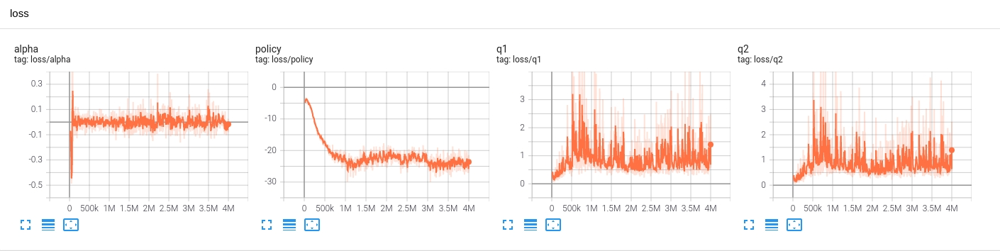

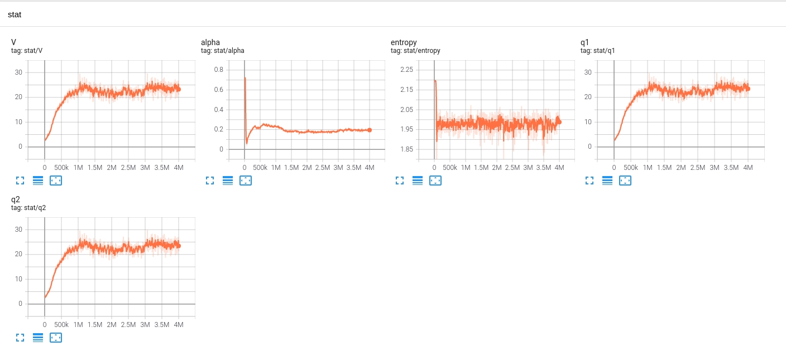

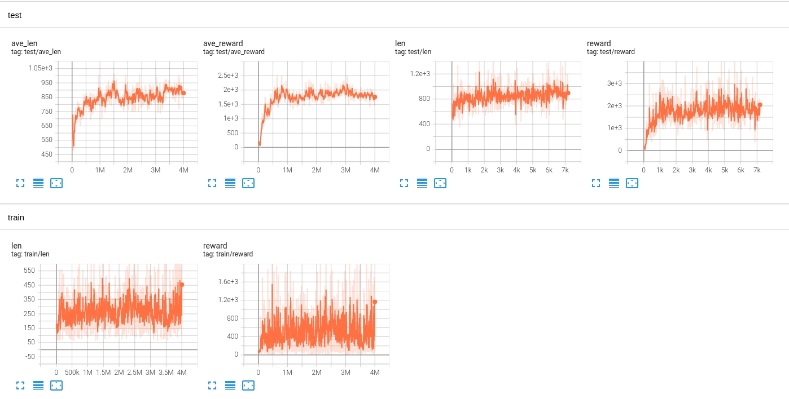

The performance was not bad but failed to improve after 1M steps.

### test2
Try bigger targetEntropyCoef for exploration:

|name|value|
|----|-----|
|envNum|1|
|targetUpdateStep|8,000|
|tau|1|
|rbCap|300,000|
|inputScale|255|
|rewardScale|1|
|rewardMin|-1|
|rewardMax|1|
|gamma|0.99|
|outputNum|9|
|batchSize|64|
|startStep|20,000|
|maxGradNormClip|1,000|
|testGapEp|10,000|
|tsetEp|3|
|testBatch|1|
|livePerEpisode|3|
|targetEntropyCoef|0.95|
|envStep|4|
|optimizer|Adam|
|lr|0.0003|

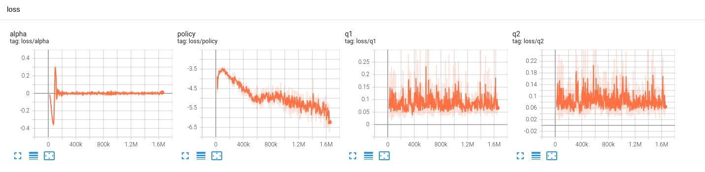

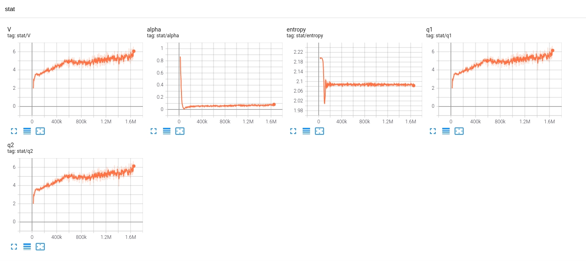

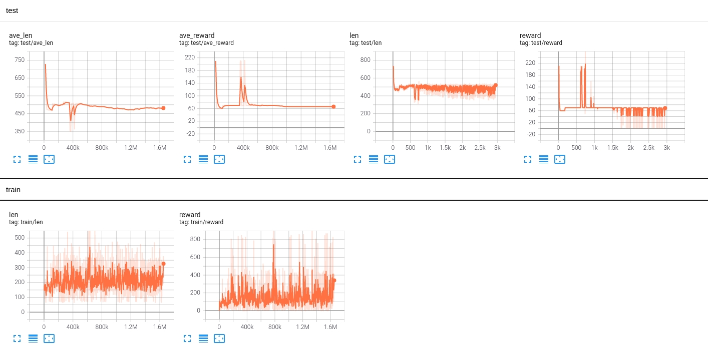

Seemed nothing wrong but the agent failed to learn. The V and alpha increased very reluctantly. Maybe the agent was busing on exploring without much exploitation. 

### test3
Try less targetEntropyCoef

|name|value|
|----|-----|
|envNum|1|
|targetUpdateStep|8,000|
|tau|1|
|rbCap|300,000|
|inputScale|255|
|rewardScale|1|
|rewardMin|-1|
|rewardMax|1|
|gamma|0.99|
|outputNum|9|
|batchSize|64|
|startStep|20,000|
|maxGradNormClip|1,000|
|testGapEp|10,000|
|tsetEp|3|
|testBatch|1|
|livePerEpisode|3|
|targetEntropyCoef|0.80|
|envStep|4|
|optimizer|Adam|
|lr|0.0003|

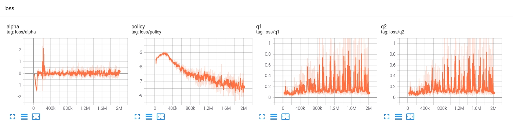

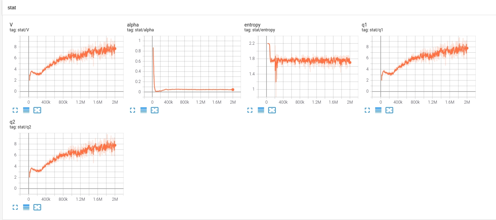

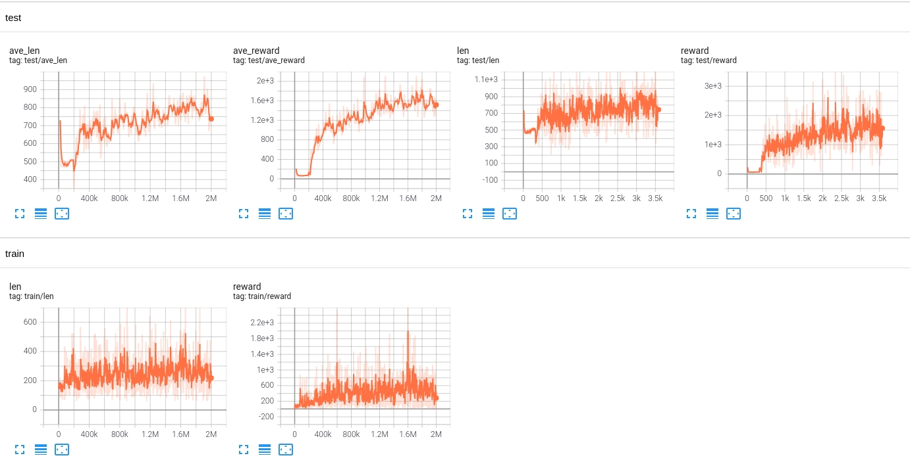

### test4
Try to continue training the model generated by test3 by bigger targetEntropyCoef for exploration.

|name|value|
|----|-----|
|envNum|1|
|targetUpdateStep|8,000|
|tau|1|
|rbCap|300,000|
|inputScale|255|
|rewardScale|1|
|rewardMin|-1|
|rewardMax|1|
|gamma|0.99|
|outputNum|9|
|batchSize|64|
|startStep|20,000|
|maxGradNormClip|1,000|
|testGapEp|10,000|
|tsetEp|3|
|testBatch|1|
|livePerEpisode|3|
|targetEntropyCoef|0.90|
|envStep|4|
|optimizer|Adam|
|lr|0.0003|

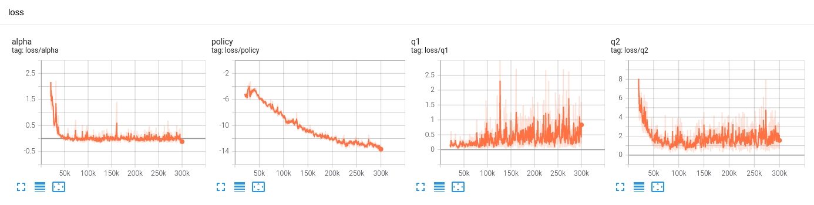

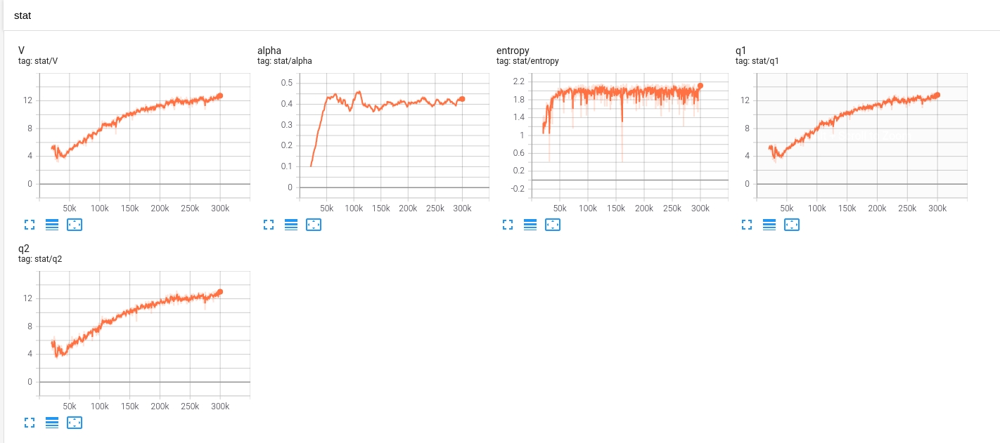

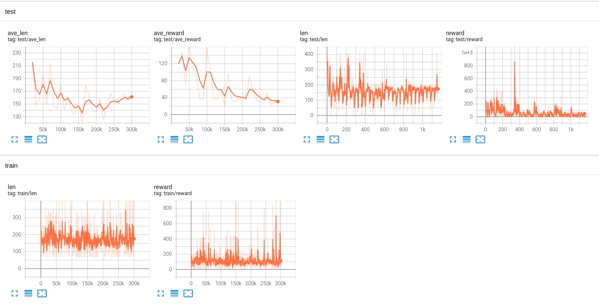

The loss and stats seemed OK but reward was bad. May need more steps.

### test6
Remove reward constraint:

|name|value|
|----|-----|
|envNum|1|
|targetUpdateStep|8,000|
|tau|1|
|rbCap|300,000|
|inputScale|255|
|rewardScale|1|
|rewardMin|-100|
|rewardMax|100|
|gamma|0.99|
|outputNum|9|
|batchSize|64|
|startStep|20,000|
|maxGradNormClip|1,000|
|testGapEp|10,000|
|tsetEp|3|
|testBatch|1|
|livePerEpisode|3|
|targetEntropyCoef|0.98|
|envStep|4|
|optimizer|Adam|
|lr|0.0003|

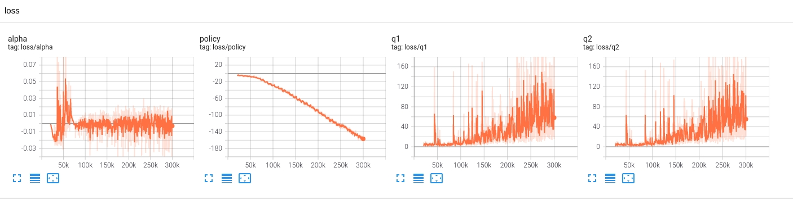

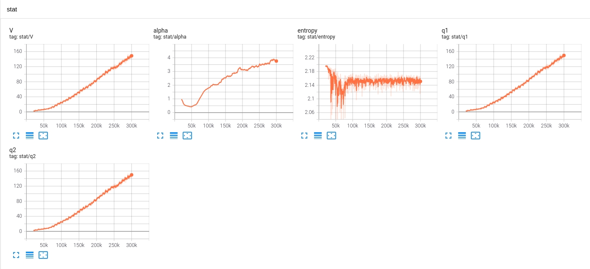

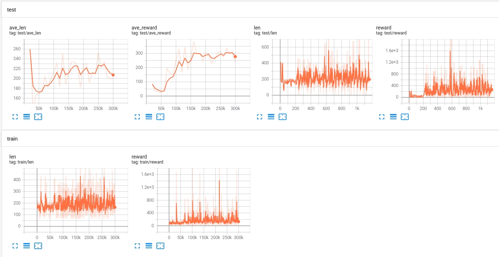

The targetEntropyCoef and Q loss were too high. Maybe clip_max_grad_ help.

### test7
Try to assign different targetEntropyCoef to different step phases:

|name|value|
|----|-----|
|envNum|1|
|targetUpdateStep|8,000|
|tau|1|
|rbCap|300,000|
|inputScale|255|
|rewardScale|1|
|rewardMin|-1|
|rewardMax|1|
|gamma|0.99|
|outputNum|9|
|batchSize|64|
|startStep|20,000|
|maxGradNormClip|1,000|
|testGapEp|10,000|
|tsetEp|3|
|testBatch|1|
|livePerEpisode|3|
|targetEntropyCoef|[0.98, 0.95], [600,000, 1,000,000]|
|envStep|4|
|optimizer|Adam|
|lr|0.0003|

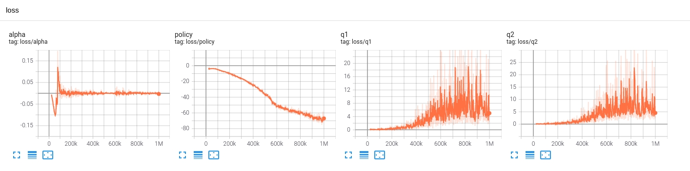

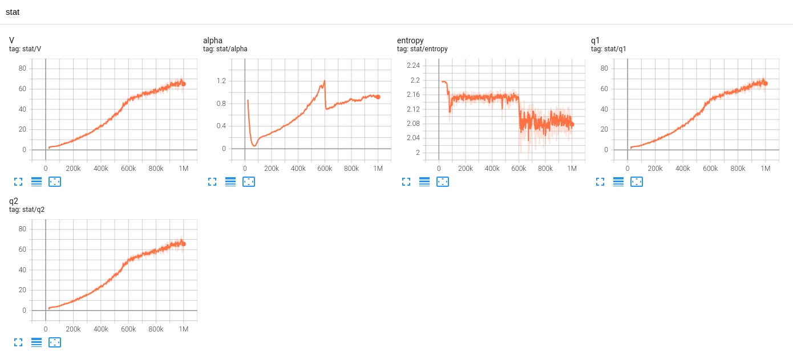

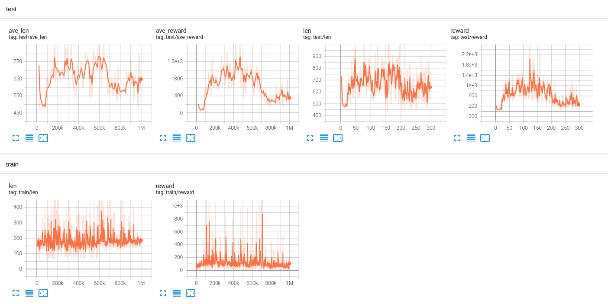

The assignment worked but not helped. More groups and steps to be tested
## TODO
[This discussion](https://github.com/rail-berkeley/softlearning/issues/149) recommended:
* keep alpha in [target_alpha, 1] guaranteed alpha converge
* targetEntropyCoef is a hyperparameter to be tuned
* for discrete SAC, the policy network could be removed, 2 critic networks (and their target networks) are enough.

## Note
Tuning targetEntropyCoef is same as tuning reward scale. To be proved.